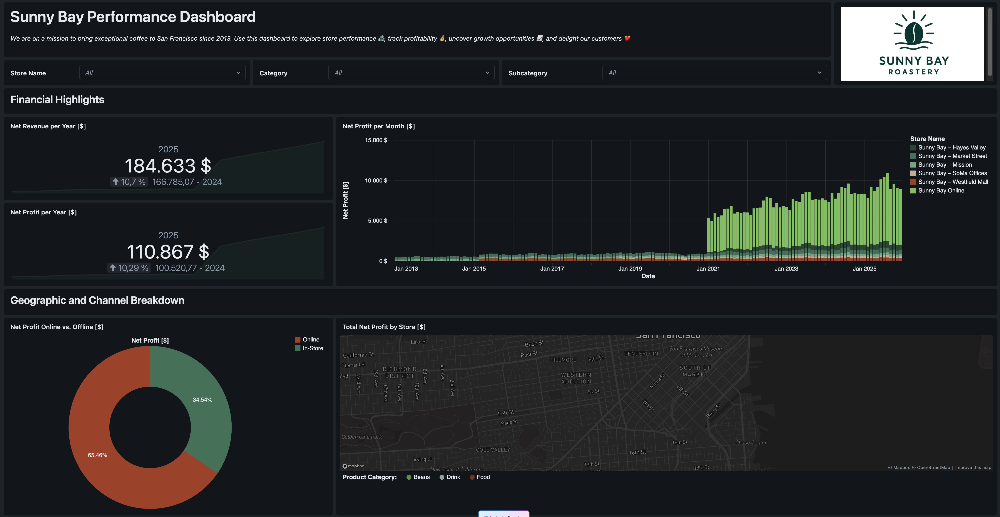

# Databricks Dashboards in a Day

A hands-on workshop covering the full Databricks BI stack — from data integration to dashboards and AI-powered analytics. Use it for instructor-led trainings or self-paced learning. This project is open source — contributions and feedback are welcome!

  

## Step 1 – Create a Databricks Free Account

Sunny Bay uses **Databricks** for analytics; you will too.

### ✅ Instructions
1. Go to [https://databricks.com/try-databricks](https://databricks.com/try-databricks)
2. Click **"Try Databricks for free"**
3. Sign up with GitHub or Google.
4. Select **Community Edition** (or Free Trial if available).
5. When ready, note your workspace URL.

---

## Step 2 – Clone This Repo & Set Up the Workshop with Lab 0

**Clone the GitHub repository into your Databricks workspace**.

### ✅ Instructions
1. In Databricks, go to the sidebar and select **Workspace**.
2. Navigate to your desired folder (e.g., under your username).
3. Click **Create > Git folder**.
4. Enter the current URL: e.g., `https://github.com/DatabricksDashboardInADay/DatabricksDashboardInADay.git`
5. Click **Create**.
6. Expand the repo folder and open the `Lab 0` notebook in the folder `labs`.

## Step 3 – Choose Your Starting Point

### ✅ Instructions
The labs are modular — you can start from any lab. Lab 0 pre-deploys all necessary assets (pipelines, Metric View, dashboards), so feel free to skip ahead to the topics that interest you most. Lab 1 comes in two flavors: **SDP** (Spark Declarative Pipelines) and **SQL**. The SQL path uses a `_sql` suffix on its table names to avoid conflicts with SDP streaming tables. Labs 2–4 use the SDP-created gold tables, which are always available after Lab 0.

| Lab | Topic | Guide |
|-----|-------|-------|
| **Lab 0** | Setup: Clone the repo, deploy assets, and configure the workspace | [guide](labs/Lab%200%20-%20Intro.ipynb) |
| **Lab 1 [SDP]** | Data Integration: Build the medallion architecture using Spark Declarative Pipelines | [guide](labs/Lab%201%20-%20%5BSDP%5D%20Data%20Integration%20and%20Transformation.md) |
| **Lab 1 [SQL]** | Data Integration: Build the same medallion architecture with pure SQL on a SQL Warehouse | [guide](labs/Lab%201%20-%20%5BSQL%5D%20Data%20Integration%20and%20Transformation.md) |
| **Lab 2** | Data Modelling: Create Metric Views to add business semantics to gold data | [guide](labs/Lab%202%20-%20Data%20Modelling.md) |
| **Lab 3** | Dashboard Creation: Build interactive AI/BI Dashboards | [guide](labs/Lab%203%20-%20Dashboard%20Creation.md) |
| **Lab 4** | BI Meets AI: Explore Databricks Genie for natural-language analytics | [guide](labs/Lab%204%20-%20BI%20Meets%20AI.md) |

### 🔎 Deep Dives (Optional)

Deep dives are standalone labs that go deeper into a specific topic. They can be completed at any point after their prerequisite lab and are independent of each other.

| Deep Dive | What to Expect | Prerequisite |
|-----------|---------------|--------------|
| **[SQL] SQL Analyst Essentials** ([guide](labs/Deep%20Dives/%5BSQL%5D%20SQL%20Analyst%20Essentials.md)) | Explore data with ad-hoc queries, create reusable SQL views, and use Genie Code to generate and optimise SQL. | Lab 1 [SQL] |
| **[SQL] Monitoring and Self-Service** ([guide](labs/Deep%20Dives/%5BSQL%5D%20Monitoring%20and%20Self-Service.md)) | Schedule recurring queries, set up SQL alerts, upload CSV data for self-service analysis, and explore Databricks One. | [SQL] SQL Analyst Essentials |
