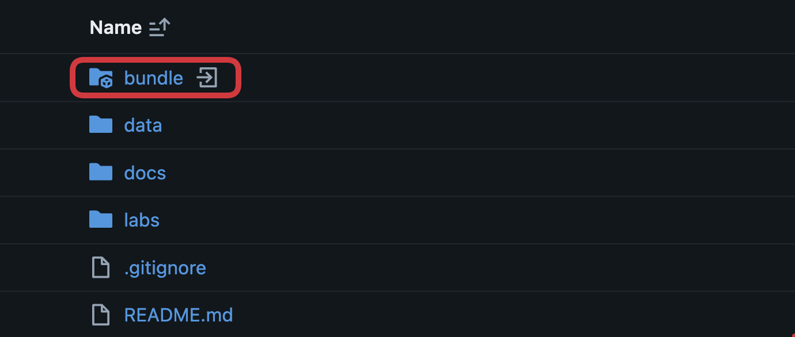
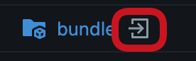
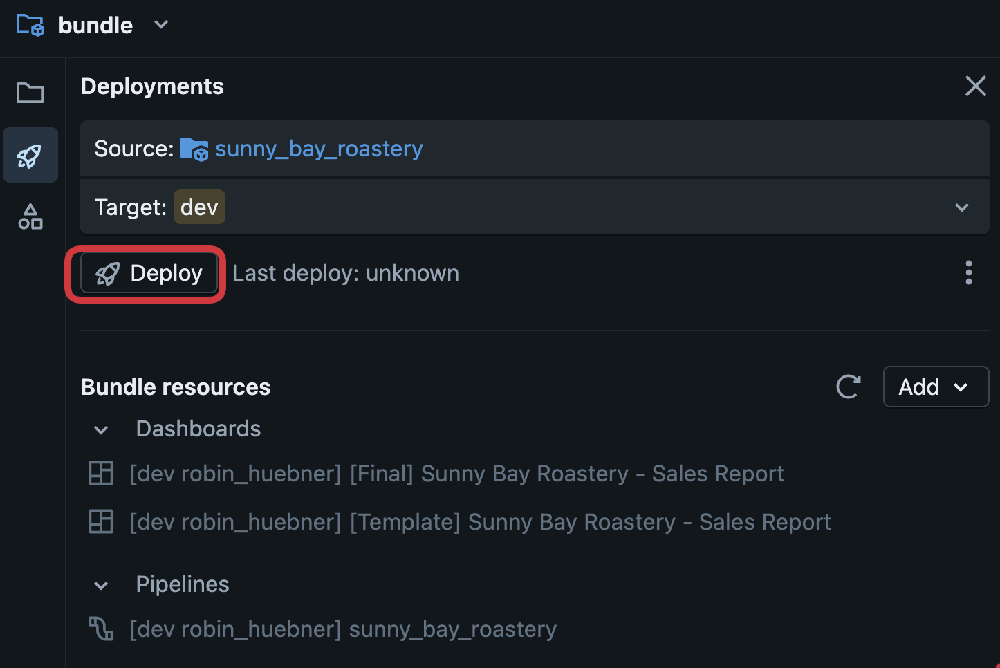
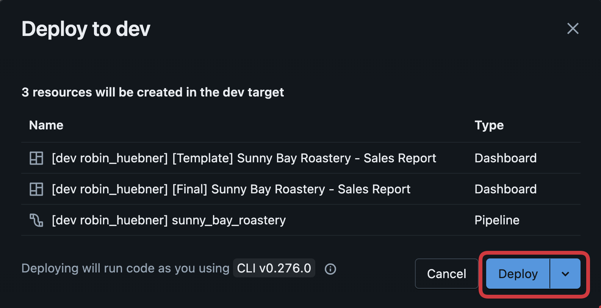
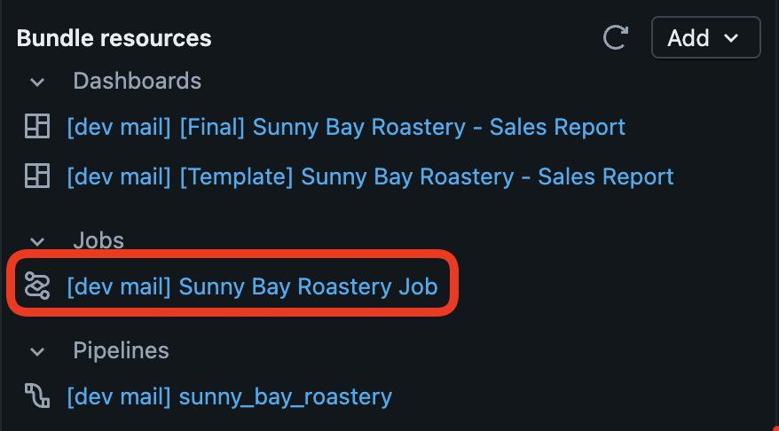

# ☕ Welcome to Sunny Bay Roastery

## 🎯 Objectives
By the end of this lab, you will:
- Have a **Databricks Free Edition** workspace.
- Have the **Sunny Bay Roastery** sales data in your workspace
- Understand the **Sunny Bay Roastery** story and your role in it.
- Have your first **catalog and schemas** (`bronze`, `silver`, `gold`) in Databricks Unity Catalog.

## 🚀 Deploy and Run the Setup Job

First, you have to start a job that will **generate Sunny Bay Roastery data**, run the initial **integration and transformation** (which we'll review and refine in Lab 1), and create your **metric view**. By default, everything is created in the `sunny_bay_roastery` catalog.

> [!IMPORTANT]
> If you need to use custom catalog or schema names, make sure to update them in your `databricks.yml` file before running the setup job.

1. Open **Workspace** Tab and click on the bundle directory in your workspace in the Git Folder you created before:

  

2. Search for the file "databricks.yml"

3. Click on `Open in the bundle editor` icon

  

4. Click on the deploy button

  

5. Confirm the deployment

  

6. Start the job

  

7. Congratulations, you just finished your workspace setup!

## ☕ Story Setup

In 2013, the very same year **Databricks** was founded, a small team of coffee enthusiasts opened a café in **San Francisco**. They called it **Sunny Bay Roastery**.

At first, they were just another boutique coffee shop, but their obsession with precision, data, and quality soon made them a local favorite. Every espresso shot was logged.

Over the next decade, Sunny Bay grew to five stores across the Bay Area. Then, in 2020, when the pandemic hit, foot traffic dropped overnight. The company had to act fast.

Online coffee bean sales exploded as people became **home baristas**, experimenting with grinders and brewing ratios while stuck at home.

Today, in 2025, Sunny Bay Roastery stands at a crossroads.  
Its CEO, **Mr. Bean**, wants to understand:
> "What really drives our coffee sales?  
>  How do seasons, holidays, and online vs. in-store trends shape our future?"

Unfortunately, the company's data is scattered:
- Some comes from old **in-store point-of-sale systems**.  
- Some from **e-commerce logs**.  
- And some information are in **Excel files** sitting in Mr. Bean's inbox.

You've just been hired as the company's first **Head of Data & Analytics**.  
Your mission: **build a unified data platform** that can turn these fragments into insight — and prepare Sunny Bay Roastery for its next phase of growth.
