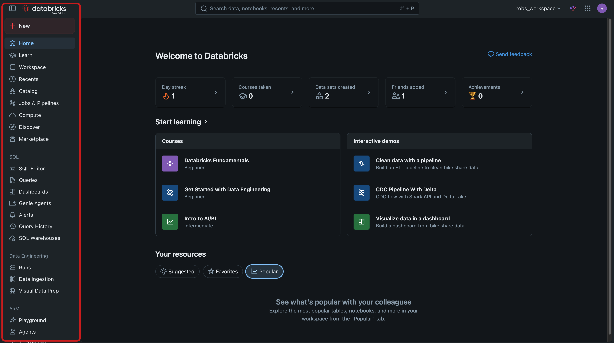
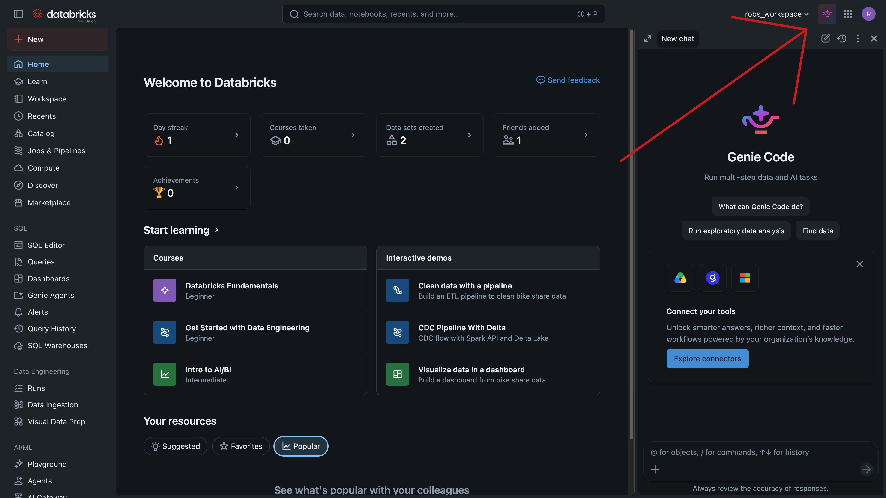
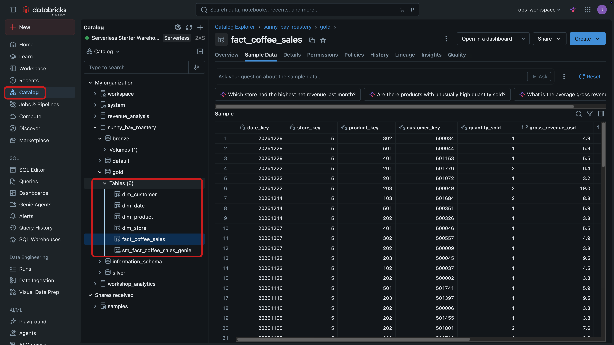
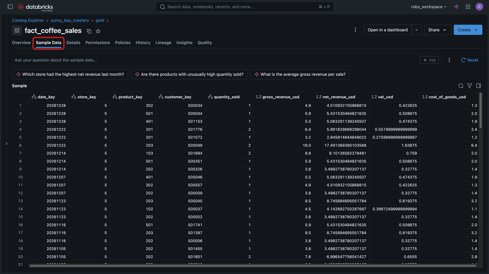
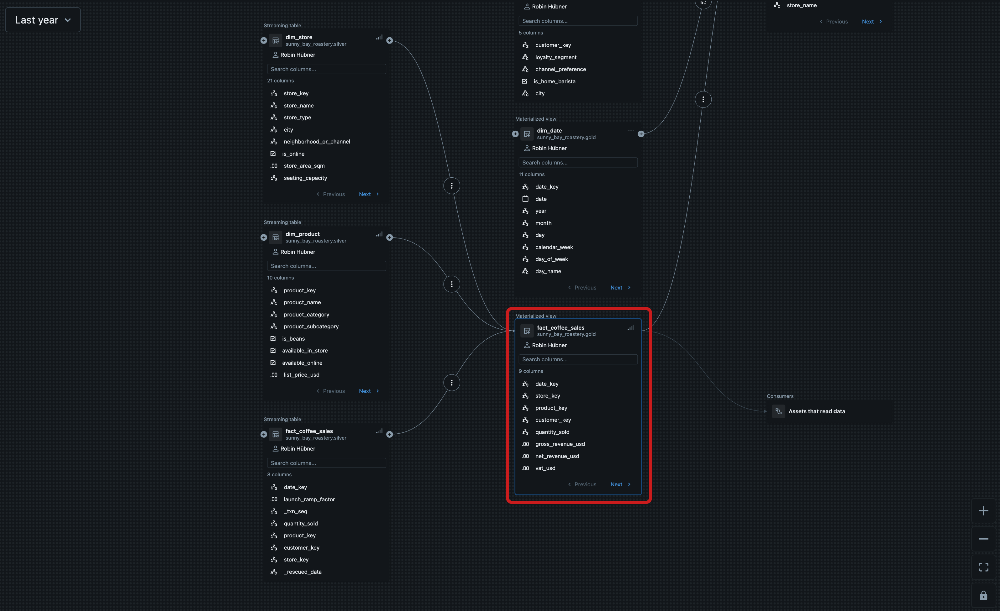
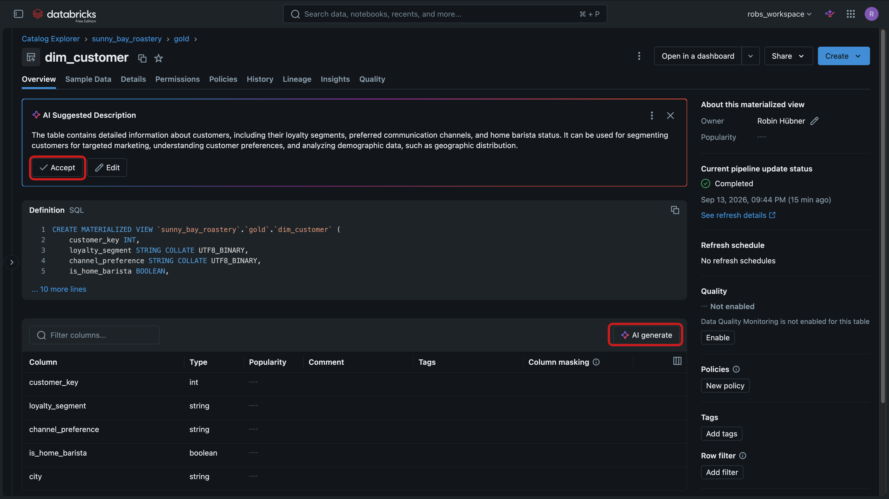

# ☕ Lab 1 – Explore Your Data with Unity Catalog & Genie Code

## 🎯 Learning Objectives
By the end of this lab, you will:
- Find your way around the **Databricks workspace** using the **sidebar**
- Meet **Genie Code**, your built-in AI assistant, and know that you can ask it a question at any point in the workshop
- Understand **Unity Catalog** and the three-level namespace (`catalog.schema.table`) that organises every asset
- Explore the **Sunny Bay Roastery** gold data — browse tables, preview sample rows, and read column descriptions
- Trace **data lineage** to see *where the gold data came from and how it was processed* — without opening a single pipeline
- Use **AI-generated descriptions** and **tags** to document and classify data
- Ask a question of your data in **plain language**
- *(Optional add-on)* Shape data visually with **Visual Data Prep** — basic data engineering, no code required

## Introduction

**Who is this lab for?**

You do not need to be a data engineer to get value from Databricks. Most people who work with Sunny Bay's data are **analysts** and **analytics engineers**: they ask business questions, model data, and build reports. This lab is your guided tour of the platform from *that* point of view.

In **Lab 0** you ran one notebook that set everything up: it generated the sales data, ran the medallion pipeline (bronze → silver → gold), built a metric view, and pre-created the dashboards and Sales Genie. So the data is already there. Your job in Lab 1 is not to *build* it — it is to **find it, understand it, and trust it**, and to learn the handful of workspace features you will use in every lab that follows.

**What you will explore**

| Feature | Why an analyst cares |
|---------|----------------------|
| **Workspace & sidebar** | Find any asset — a table, query, dashboard, or notebook — in seconds |
| **Genie Code** | An AI copilot that answers questions and writes SQL for you, everywhere in the workspace |
| **Unity Catalog** | The single, governed source of truth for all data and its metadata |
| **Lineage** | See how a number was calculated and where it came from, so you can trust it |
| **Descriptions & tags** | Make data self-explanatory and discoverable for the whole team |

> [!TIP]
> The golden rule of this workshop: **whenever you are unsure about anything — a button, a term, a query — ask Genie Code.** You will meet it in Step 2, and it stays one click away for the rest of the day.

## Instructions

Before you start, please verify:
- You have completed **Lab 0** and its setup job shows **Succeeded** — this means the `sunny_bay_roastery` catalog and its `gold` tables exist.
- You are signed in to your Databricks workspace (Free Edition is fine).

> [!NOTE]
> This lab uses the default catalog name `sunny_bay_roastery`. If you set a different catalog or a `prefix` in Lab 0, substitute it wherever you see `sunny_bay_roastery` or a table name below.

**Step 1: Get Your Bearings in the Workspace**

Take a minute to orient yourself before touching any data.

1. Look at the **left sidebar** — this is how you navigate Databricks. The items you will use most in this workshop are:
   - **Workspace** — your files, notebooks, and Git folders (this is where Lab 0 lives).
   - **Catalog** — all your data, organised by Unity Catalog. *You will spend most of Lab 1 here.*
   - **SQL Editor** — write and run SQL queries.
   - **Dashboards** — AI/BI dashboards (Lab 3).
   - **Genie** — ask business questions in natural language (Lab 4).
   - **Jobs & Pipelines** — scheduled and automated data processing.

  

**💡 What just happened?**

You now know the places you will return to all day. Everything in the workshop is reachable from that sidebar — you do not need to memorise anything else.

**Step 2: Meet Genie Code — Your AI Assistant**

**Genie Code** is the AI copilot built into Databricks. It can answer questions, explain features, generate and fix SQL, and help you build dashboards — all using the metadata in Unity Catalog, so it already understands your tables.

1. Open **Genie Code**. You can reach it from the assistant icon in the workspace, or by pressing `Cmd + I` (Mac) / `Ctrl + I` (Windows) inside an editor.

2. Ask it a plain-language question to get comfortable, for example:

   > *"What is the medallion architecture, and where is the Sunny Bay Roastery gold data?"*

3. Read the answer, then try a workshop-specific one:

   > *"What columns are in the sunny_bay_roastery.gold.fact_coffee_sales table?"*

  

> [!TIP]
> Genie Code is a **copilot, not autopilot** — always read what it produces before you run it. But treat it as your first stop whenever you are stuck in this workshop.

**💡 What just happened?**

You learned where your AI assistant lives and that it already knows your data. From here on, "ask Genie Code" is a valid step for *any* question you have.

**Step 3: Open Unity Catalog and Find Your Data**

**Unity Catalog** is where all of Sunny Bay's data lives, governed in one place. Every table has a three-level address: **`catalog.schema.table`** — for example `sunny_bay_roastery.gold.fact_coffee_sales`.

1. In the sidebar, click **Catalog**.

2. Expand the **`sunny_bay_roastery`** catalog. You will see three schemas that match the medallion layers:
   - **`bronze`** — raw data as it landed (plus a `raw` Volume of the original files).
   - **`silver`** — cleansed and validated data.
   - **`gold`** — business-ready tables, ready for reporting and AI.

3. Expand **`gold`**. This is your analyst home base. It holds a classic **star schema**: one central *fact* table surrounded by *dimension* tables.

  

**☕ Meet your data**

| Table | What it holds | Grain (one row = ) |
|-------|---------------|--------------------|
| `fact_coffee_sales` | Every sale, enriched with revenue, cost, and VAT | one sold line item |
| `dim_product` | The coffee, beans, and gear Sunny Bay sells | one product |
| `dim_store` | Cafés and the online channel | one store |
| `dim_customer` | Loyalty segment and channel preference | one customer |
| `dim_date` | Calendar with seasons, weekends, and holidays | one day |

**💡 What just happened?**

You located the governed source of truth for the whole company. Notice you did not need to know *where the files physically live* — Unity Catalog gives every asset one clean, permission-controlled address.

**Step 4: Explore the Gold Fact Table**

Let's get to know `fact_coffee_sales` — the table every dashboard and Genie answer is built on.

1. In the `gold` schema, click **`fact_coffee_sales`** to open it in **Catalog Explorer**.

2. On the **Overview / Columns** tab, review the columns and their data types. Notice the enriched business metrics that were calculated for you: `gross_revenue_usd`, `net_revenue_usd`, `vat_usd`, and `cost_of_goods_usd`.

3. Open the **Sample Data** tab to preview real rows without writing any SQL.

  

4. Open the **Details** tab. Note that this is a **managed** gold table, and see its owner and the schema it belongs to.

5. Switch back to the **Overview** tab and read the **column descriptions** (comments) shown next to each column. Good descriptions are what let both people *and* Genie Code understand the data correctly — the `gold` tables were documented for you during setup.

> [!TIP]
> Not sure what a column like `date_key` means? Highlight it and **ask Genie Code** — it reads the same Unity Catalog metadata you are looking at.

**💡 What just happened?**

In one screen you inspected the schema, previewed the data, and confirmed what each field means — the questions an analyst asks before trusting a table.

**Step 5: Trace the Lineage — Where Did This Data Come From?**

Before you build a report on a number, you want to know *how it was produced*. **Lineage** shows you exactly that — visually, without opening any pipeline code.

1. With `fact_coffee_sales` open, click the **Lineage** tab, then open the **lineage graph** (**See lineage graph**).

2. Follow the flow **upstream** (to the left). You will see the data's journey through the medallion layers:

   `raw files (Volume)` → `silver.fact_coffee_sales` → `gold.fact_coffee_sales` (joined with the `dim_*` tables)

   This is the *same* processing the Lab 0 pipeline performed — but you are reading it as a diagram, not as pipeline code.

3. Now follow the flow **downstream** (to the right). The gold table's consumers appear under **Assets that read data**. That is everything built on top of it — the **metric view** (`sm_fact_coffee_sales_genie`) from Lab 2, the **AI/BI dashboards** from Lab 3, and the **Sales Genie** from Lab 4.

  

> [!NOTE]
> Lineage is **execution-driven**: a downstream asset appears once it has actually queried the table. On a freshly-run workshop the consumers may still be collapsed under *Assets that read data* — open the dashboard or ask the Sales Genie a question, then refresh the graph to watch the metric view, dashboards, and Genie light up.

4. Click a **column** in the graph (for example `gross_revenue_usd`) to see **column-level lineage** — which upstream columns were combined to calculate it.

**💡 What just happened?**

You answered "can I trust this number?" without reading a line of pipeline code. Lineage is how analysts and auditors trace any figure back to its source — and how you see the impact *before* you change anything.

**Step 6: Document and Classify Data (AI-Assisted)**

Well-described data is easier for people to find and for Genie Code to query accurately. During setup, the `gold` tables were given rich **descriptions** and **tags** automatically — open `fact_coffee_sales` or `dim_product` and you will see a table description and per-column comments already in place.

One table was left undocumented on purpose: **`dim_customer`**. Documenting it is your job — and Databricks' AI will draft it for you.

1. In the `gold` schema, open **`dim_customer`**. Notice its **description is empty** and its columns have no comments — unlike the other gold tables.

2. On the table, click **AI generate** (the ✨ suggestion). Databricks proposes a plain-language description based on the schema and data. Review it, edit if needed, and click **Accept**.

3. Use **AI generate** on the columns to draft column comments as well, and accept them. `dim_customer` is now documented like the rest of the schema.

4. Add a **tag** to the table — for example a key/value like `domain: sales` or `certified: true`. Tags make assets easy to filter and group across the whole catalog.

  

> [!NOTE]
> Descriptions and tags are **governance metadata** — they travel with the table for everyone who has access, and they directly improve the quality of Genie's answers. A well-documented `gold` schema is what makes self-service analytics work.

**Step 7: Ask a Question of Your Data**

You have explored the data — now use it. There are two fast, code-optional ways to answer a question.

1. **Look at live data instantly:** open the **Sample Data** tab on `fact_coffee_sales` (as you did in Step 4) to preview real rows — no SQL and no query to run.

2. **Ask in natural language:** open **Genie Code** and ask a business question, for example:

   > *"Which Sunny Bay store had the highest gross revenue, and how does online compare to in-store?"*

3. Review the SQL it generates, run it, and read the result. Try a follow-up in plain language, such as *"now break that down by year."*

**💡 What just happened?**

You went from *browsing* data to *answering a business question* — with either a one-click preview or a plain-language prompt. This is the everyday analyst loop you will use in Labs 2–4.

**Step 8: (Optional Add-On) Shape Data Visually with Visual Data Prep**

So far you have *read* the gold data. In this optional add-on you will do a little **data engineering yourself — visually, with no code** — using **Visual Data Prep**, where you describe what you want and Genie builds the transformation flow for you.

**The task:** build a small "Top products by revenue" dataset for Mr. Bean.

1. In the **left sidebar** (under *Data Engineering*), click **Visual Data Prep**, then **New visual data prep**.

2. In the Genie prompt box, describe the dataset you want. Paste:

   > *"Build a table of the top products by total gross revenue. Join `sunny_bay_roastery.gold.fact_coffee_sales` to `sunny_bay_roastery.gold.dim_product` on `product_key`, group by `product_name`, sum `gross_revenue_usd` as `total_revenue_usd`, and sort from highest to lowest."*

3. Review the flow Genie builds — a source, a join, an aggregate, and a sort — and **preview** the result right in the canvas. Each node is a transformation you can see, reorder, and edit, so the logic stays transparent.

4. *(Optional)* Save the output to a new gold table, for example `sunny_bay_roastery.gold.top_products_by_revenue`, and run it.

**💡 What just happened?**

You built a new, reusable dataset from the gold data **without writing code** — the essence of the analytics-engineer workflow. You described the goal in plain language and Visual Data Prep turned it into a transparent, editable flow.

## Final Steps

You have toured the workspace and, more importantly, learned to **trust and use** the Sunny Bay data:

- Navigated **Unity Catalog** and the `gold` star schema
- Previewed data, read column descriptions, and inspected table details
- Traced **lineage** upstream to the raw files and downstream to metric views, dashboards, and Genie
- Documented `dim_customer` with **AI-generated descriptions** and **tags**
- Answered a business question with the Sample Data preview and with **Genie Code**
- *(Optional)* Built a dataset visually with **Visual Data Prep**

> [!TIP]
> Curious *how* the gold data was actually built? Two optional Deep Dives rebuild the medallion architecture yourself — **[SDP] Building the Medallion Pipeline** and **[SQL] Building the Medallion with SQL** — for anyone who wants the data-engineering view.

## What Happens Next?

Now that you know where the trustworthy `gold` data lives and how it flows, you are ready to add a **business semantic layer** on top of it.

Continue with **Lab 2 – Data Modelling**, where you will build a **Metric View** so that measures like *total net revenue* mean the same thing to every dashboard, query, and Genie answer.
