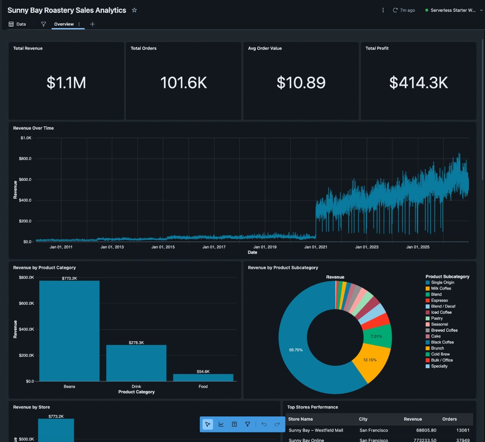

# ☕ Lab 1 [SQL] – Data Integration and Transformation

## 🎯 Learning Objectives
By the end of this lab, you will:
- Understand the **medallion architecture** (bronze → silver → gold) and how to implement it with pure SQL  
- Use **Databricks SQL** and a **SQL Warehouse** to load, cleanse, and transform data without Spark or pipelines  
- Apply basic data quality filtering using SQL `WHERE` clauses  
- Enrich a gold fact table with derived business metrics (revenue, cost, VAT, currency conversion)  
- Create an aggregated gold table for reporting  
- Verify results using Unity Catalog and the Databricks SQL Editor
- (Optional) Use **Genie Code** on a new dashboard to build from all tables in **`sunny_bay_roastery.gold`** with a single natural-language prompt

## Introduction

**Why a SQL-Only Path?**

Many analysts work primarily in SQL and may not use Spark notebooks or Spark Declarative Pipelines day-to-day. This lab provides a familiar SQL workflow that achieves the same medallion-architecture outcomes as the SDP path:

- All transformations are standard SQL — no Python, no Spark APIs  
- You run queries directly in the **Databricks SQL Editor** attached to a **SQL Warehouse**  
- The resulting tables land in Unity Catalog and are immediately usable by Metric Views, Dashboards, and Genie  

**What Is the Medallion Architecture?**

The medallion architecture organises data into three layers:

| Layer | Purpose | Tables in this lab |
|-------|---------|-------------------|
| **Bronze** | Raw ingestion — load files as-is into managed tables | `dim_customer_sql`, `dim_date_sql`, `dim_product_sql`, `dim_store_sql`, `fact_coffee_sales_sql` |
| **Silver** | Cleansed — remove invalid records, standardise types | Same table names in the `silver` schema |
| **Gold** | Business-ready — add calculated metrics, join facts to dimensions | `fact_coffee_sales_sql` (enriched), `dim_*_sql` tables, `total_revenue_by_year_sql` |

## Instructions

Before you start, please verify:
- You have completed **Lab 0** and the synthetic data has been generated.
- You have access to a **SQL Warehouse** (Serverless Starter Warehouse or Pro).

> **Note:** All queries in the SQL labs use the default catalog name `sunny_bay_roastery`. If a different catalog name was set in `databricks.yml` before deploying, replace `sunny_bay_roastery` with that name throughout.

**Step 1: Connect to a SQL Warehouse**

1. In the Databricks sidebar, click **SQL Warehouses**.
2. If the **Serverless Starter Warehouse** is available, start it (or confirm it is running).
3. If no warehouse exists, click **Create SQL Warehouse**, choose **Serverless**, and name it `Serverless Starter Warehouse`.
4. Open the **SQL Editor** from the sidebar — this is where you will run all queries in this lab.
5. In the top-right of the SQL Editor, confirm your warehouse is selected as the compute target.

**Step 2: Create Bronze Tables**

In this step you will load the raw CSV and Parquet files from the Unity Catalog Volume into managed bronze tables.

1. Open the **SQL Editor** in the Databricks sidebar.
2. Open the notebook **`Create Bronze Tables.dbquery.ipynb`** from the folder `labs/artifacts/Lab 1 - [SQL] Data Integration and Transformation/` in your workspace. Alternatively, copy the SQL below into a new query tab.
3. Run the full query. This loads all five tables into the `bronze` schema:

```sql
-- Customer dimension (CSV)
CREATE OR REPLACE TABLE sunny_bay_roastery.bronze.dim_customer_sql AS
SELECT * FROM read_files(
  '/Volumes/sunny_bay_roastery/bronze/raw/dim_customer/',
  format => 'csv',
  header => true,
  inferSchema => true
);

-- Date dimension (CSV)
CREATE OR REPLACE TABLE sunny_bay_roastery.bronze.dim_date_sql AS
SELECT * FROM read_files(
  '/Volumes/sunny_bay_roastery/bronze/raw/dim_date/',
  format => 'csv',
  header => true,
  inferSchema => true
);

-- Product dimension (CSV)
CREATE OR REPLACE TABLE sunny_bay_roastery.bronze.dim_product_sql AS
SELECT * FROM read_files(
  '/Volumes/sunny_bay_roastery/bronze/raw/dim_product/',
  format => 'csv',
  header => true,
  inferSchema => true
);

-- Store dimension (CSV)
CREATE OR REPLACE TABLE sunny_bay_roastery.bronze.dim_store_sql AS
SELECT * FROM read_files(
  '/Volumes/sunny_bay_roastery/bronze/raw/dim_store/',
  format => 'csv',
  header => true,
  inferSchema => true
);

-- Coffee sales fact (Parquet)
CREATE OR REPLACE TABLE sunny_bay_roastery.bronze.fact_coffee_sales_sql AS
SELECT * FROM read_files(
  '/Volumes/sunny_bay_roastery/bronze/raw/fact_coffee_sales/',
  format => 'parquet'
);
```

4. After the query completes, navigate to **Catalog > sunny_bay_roastery > bronze** in the sidebar to confirm all five tables are visible.

**💡 What just happened?**

- `read_files()` is a Databricks SQL function that reads files directly from a Unity Catalog Volume path.
- CSV files use `header => true` and `inferSchema => true` so column names and types are detected automatically.
- Parquet files are self-describing — no additional options are needed.
- Each `CREATE OR REPLACE TABLE` creates a managed Delta table in the `bronze` schema.

**Step 3: Create Silver Tables**

Now you will promote the bronze data into the silver layer, applying a basic data quality filter to remove invalid sales records.

1. Open **`Create Silver Tables.dbquery.ipynb`** from the same folder, or copy the SQL below into a new query tab.
2. Run the full query:

```sql
-- Date dimension
CREATE OR REPLACE TABLE sunny_bay_roastery.silver.dim_date_sql AS
SELECT * FROM sunny_bay_roastery.bronze.dim_date_sql;

-- Store dimension
CREATE OR REPLACE TABLE sunny_bay_roastery.silver.dim_store_sql AS
SELECT * FROM sunny_bay_roastery.bronze.dim_store_sql;

-- Customer dimension
CREATE OR REPLACE TABLE sunny_bay_roastery.silver.dim_customer_sql AS
SELECT * FROM sunny_bay_roastery.bronze.dim_customer_sql;

-- Product dimension
CREATE OR REPLACE TABLE sunny_bay_roastery.silver.dim_product_sql AS
SELECT * FROM sunny_bay_roastery.bronze.dim_product_sql;

-- Coffee sales fact (filter invalid quantities)
CREATE OR REPLACE TABLE sunny_bay_roastery.silver.fact_coffee_sales_sql AS
SELECT * FROM sunny_bay_roastery.bronze.fact_coffee_sales_sql
WHERE quantity_sold > 0;
```

3. Navigate to **Catalog > sunny_bay_roastery > silver** to confirm the tables.

**💡 What just happened?**

- Dimension tables are promoted as-is from bronze to silver.
- The fact table includes `WHERE quantity_sold > 0` — this is a simple but important data quality rule that removes 20 rows with intentionally invalid data (negative quantities injected during Lab 0).
- In the SDP path, this same filtering is done with a declarative `CONSTRAINT ... EXPECT ... ON VIOLATION DROP ROW` expectation. In pure SQL, a `WHERE` clause achieves the same outcome.

**🔍 Try it yourself — Explore the data quality impact:**

Run this query to see how many rows were filtered out:

```sql
SELECT
  (SELECT COUNT(*) FROM sunny_bay_roastery.bronze.fact_coffee_sales_sql) AS bronze_rows,
  (SELECT COUNT(*) FROM sunny_bay_roastery.silver.fact_coffee_sales_sql) AS silver_rows,
  (SELECT COUNT(*) FROM sunny_bay_roastery.bronze.fact_coffee_sales_sql)
    - (SELECT COUNT(*) FROM sunny_bay_roastery.silver.fact_coffee_sales_sql) AS rows_removed;
```

**Step 4: Create Gold Tables**

The gold layer joins fact data with dimension tables and adds calculated business metrics.

1. Open **`Create Gold Tables.dbquery.ipynb`** from the same folder, or copy the SQL below.
2. Run the full query:

```sql
-- Dimension tables promoted to gold
CREATE OR REPLACE TABLE sunny_bay_roastery.gold.dim_date_sql AS
SELECT
    date_key,
    date,
    year,
    month,
    day,
    calendar_week,
    day_of_week,
    day_name,
    is_weekend,
    season,
    is_us_public_holiday
FROM sunny_bay_roastery.silver.dim_date_sql;

CREATE OR REPLACE TABLE sunny_bay_roastery.gold.dim_store_sql AS
SELECT
    store_key,
    store_name,
    store_type,
    city,
    neighborhood_or_channel,
    is_online,
    store_area_sqm,
    seating_capacity,
    num_employees,
    store_manager,
    tax_rate,
    country_name,
    country_iso2,
    country_iso3,
    state_province,
    state_iso2,
    county_district,
    postal_code,
    latitude,
    longitude
FROM sunny_bay_roastery.silver.dim_store_sql;

CREATE OR REPLACE TABLE sunny_bay_roastery.gold.dim_customer_sql AS
SELECT
    customer_key,
    loyalty_segment,
    channel_preference,
    is_home_barista,
    city
FROM sunny_bay_roastery.silver.dim_customer_sql;

CREATE OR REPLACE TABLE sunny_bay_roastery.gold.dim_product_sql AS
SELECT
    product_key,
    product_name,
    product_category,
    product_subcategory,
    is_beans,
    available_in_store,
    available_online,
    list_price_usd,
    cost_of_goods_usd
FROM sunny_bay_roastery.silver.dim_product_sql;

-- Enriched fact table with business metrics
CREATE OR REPLACE TABLE sunny_bay_roastery.gold.fact_coffee_sales_sql AS
SELECT
    fcs.date_key,
    fcs.store_key,
    fcs.product_key,
    fcs.customer_key,
    fcs.quantity_sold,
    dp.list_price_usd * fcs.quantity_sold                       AS gross_revenue_usd,
    (dp.list_price_usd * fcs.quantity_sold) / (1 + ds.tax_rate) AS net_revenue_usd,
    ds.tax_rate * dp.list_price_usd * fcs.quantity_sold         AS vat_usd,
    dp.cost_of_goods_usd * fcs.quantity_sold                    AS cost_of_goods_usd,
    (dp.list_price_usd * fcs.quantity_sold) * 1.1               AS gross_revenue_eur
FROM sunny_bay_roastery.silver.fact_coffee_sales_sql fcs
JOIN sunny_bay_roastery.silver.dim_product_sql dp
  ON fcs.product_key = dp.product_key
JOIN sunny_bay_roastery.silver.dim_store_sql ds
  ON fcs.store_key = ds.store_key;

-- Aggregated revenue by store
CREATE OR REPLACE TABLE sunny_bay_roastery.gold.total_revenue_by_year_sql AS
SELECT
    store_key AS store_key,
    SUM(gross_revenue_usd) AS total_gross_revenue_usd
FROM sunny_bay_roastery.gold.fact_coffee_sales_sql
GROUP BY store_key;
```

3. Navigate to **Catalog > sunny_bay_roastery > gold** to confirm the tables and explore column-level details.

**💡 What just happened?**

The enriched `fact_coffee_sales_sql` table now contains five new business columns:

| Column | Formula | Purpose |
|--------|---------|---------|
| `gross_revenue_usd` | `list_price_usd × quantity_sold` | Revenue before tax and costs |
| `net_revenue_usd` | `gross_revenue_usd / (1 + tax_rate)` | Revenue after VAT |
| `vat_usd` | `tax_rate × list_price_usd × quantity_sold` | Tax component |
| `cost_of_goods_usd` | `cost_of_goods_usd × quantity_sold` | Total COGS |
| `gross_revenue_eur` | `gross_revenue_usd × 1.1` | EUR conversion (fixed rate) |

The `total_revenue_by_year_sql` table provides a pre-aggregated summary for quick store-level reporting.

**🔍 Try it yourself — Verify the gold data:**

Run a quick sanity check to see revenue by store:

```sql
SELECT
    ds.store_name,
    ROUND(SUM(fcs.gross_revenue_usd), 2) AS total_revenue_usd,
    ROUND(SUM(fcs.net_revenue_usd), 2) AS total_net_revenue_usd,
    ROUND(SUM(fcs.cost_of_goods_usd), 2) AS total_cogs_usd,
    COUNT(*) AS total_orders
FROM sunny_bay_roastery.gold.fact_coffee_sales_sql fcs
JOIN sunny_bay_roastery.gold.dim_store_sql ds
  ON fcs.store_key = ds.store_key
GROUP BY ds.store_name
ORDER BY total_revenue_usd DESC;
```

**Step 5: Explore with Genie Code (Optional)**

**Genie Code** can help you write and refine SQL queries interactively. Try the following:

1. In the SQL Editor, click on the **Genie Code** icon (or press `Cmd+I` / `Ctrl+I`).
2. Ask Genie Code: *"Show me the top 5 products by gross revenue in 2024"*
3. Review the generated SQL, run it, and inspect the results.
4. Try follow-up questions:
   - *"Now break that down by store"*
   - *"Add the cost of goods and calculate profit margin as a percentage"*
   - *"Which day of the week has the highest average order value?"*

Genie Code uses the table and column metadata from Unity Catalog. Because your gold tables have clear names and standard column conventions, it can generate accurate queries without additional context.

**Step 6: Build a Sales Analytics Dashboard with Genie Code (Optional)**

In **Step 5** you used Genie Code inside the **SQL Editor** to write queries. In this optional step you use **Genie Code** on a **new dashboard**: one prompt is enough for it to wire up data and visuals from your gold schema — you do not need to add data sources or name the dashboard yourself first.

1. In the sidebar, open **Dashboards**.
2. Click **Create Dashboard** to start a blank dashboard.
3. Click the **Genie Code** icon in the toolbar.
4. Try a prompt such as:

   > *"Hey Genie, can you build me a great dashboard based on all the tables in the schema sunny_bay_roastery.gold?"*

   Genie Code can suggest a dashboard title, attach the relevant tables from that schema, and create visuals (KPIs, trends, breakdowns, and more) in one go. Accept or adjust what it proposes.

5. From there, refine in plain language — e.g. add a chart, change a title, or tweak a measure — or edit widgets manually. Optionally **Publish** when you are happy.

**💡 What just happened?**

- **Genie Code** uses **Unity Catalog** metadata for `sunny_bay_roastery.gold`, so it understands your fact and dimension tables and can join them without you picking tables one by one.
- You get from curated tables to a working dashboard quickly; **Lab 3** goes deeper on manual layout, filters, and polish.

**Example — what you might see**

The screenshot below is one possible result (layout and figures vary by prompt and workspace version).

<div style="text-align:left;">
  
</div>

**Step 7: Upload and Explore a CSV File (Optional)**

Databricks allows you to upload CSV or Excel files directly and query them alongside your existing data.

1. In the sidebar, navigate to **Catalog > sunny_bay_roastery > gold**.
2. Click **Create Table** and select **Upload file**.
3. Upload a CSV file of your choice (for example, a budget or target file).
4. Once uploaded, the file becomes a managed table that you can join to the Sunny Bay data using SQL.

This is a common analyst workflow for bringing in ad-hoc reference data (targets, budgets, lookup lists) without needing a data engineer to set up a pipeline.

## Final Steps

If you run into errors you can't resolve, you can review the full SQL notebooks in the folder:

**`labs/artifacts/Lab 1 - [SQL] Data Integration and Transformation/`**

- `Create Bronze Tables.dbquery.ipynb`
- `Create Silver Tables.dbquery.ipynb`
- `Create Gold Tables.dbquery.ipynb`

These contain the complete, tested SQL for each layer.

## SQL Path vs SDP Path — Quick Comparison

| Aspect | SQL Path (this lab) | SDP Path (Lab 1) |
|--------|-------------------|-------------------|
| **Compute** | SQL Warehouse | Serverless pipeline |
| **Authoring** | SQL Editor / `.dbquery.ipynb` notebooks | `.sql` files in bundle |
| **Data quality** | `WHERE` clause filtering | `CONSTRAINT ... EXPECT` declarations |
| **Table type** | Managed Delta tables (`CREATE OR REPLACE TABLE`) | Streaming tables + materialized views |
| **Table names** | `*_sql` suffix (e.g. `fact_coffee_sales_sql`) | Original names (e.g. `fact_coffee_sales`) |
| **Orchestration** | Manual execution (or scheduled queries) | Automated pipeline with dependency tracking |
| **Best for** | Ad-hoc analysis, analyst self-service | Production ETL, continuous processing |

The SQL path uses a `_sql` suffix on all table names (e.g. `fact_coffee_sales_sql`) so they do not conflict with the streaming tables created by the SDP pipeline. Labs 2–4 use the SDP-created gold tables, which are always available after Lab 0.

## What Happens Next?

You have successfully built a complete medallion architecture using pure SQL.  
Your gold tables now include:

- Data quality enforcement  
- Extended business logic (revenue, cost, VAT, EUR conversion)  
- Aggregated store-level metrics  

These enriched datasets will be used in **Lab 2**, where you will build Metric Views on top of this refined gold layer.
