# ☕ Lab 2 – Data Modelling: Bring Context and Business Semantics to your data

## 🎯 Learning Objectives
By the end of this lab, you will:
- Understand how [Databricks Metric Views](https://learn.microsoft.com/azure/databricks/metric-views/) will allow you to add business semantics using relationships and calculations to your data
- Create a metric view with
    - relationships to our tables to allow implicit joining of tables.
    - dimensions and measures with attributes and common calcutions
    - formating instructions and synomyns
- Publish the metric view to make it available in Unity Catalog to make it accessable by subsequent features and tools such as Databricks Dashboards.

## Introduction

**What Are Metric Views?**

Metric views are reusable semantic models in Databricks that define business logic for KPIs, calculations, joins, and dimensions in a standardized way.

They allow consistent reporting, simplify complex SQL logic, and centralize metric definitions for dashboards, notebooks, and BI tools.​

**Why Use Metric Views?**

- Ensure “one version of the truth” by standardizing metrics and calculations organization-wide.

- Enable flexible exploration of metrics across any dimension (e.g., sales by product, region, or time) without rebuilding SQL queries.

- Simplify maintenance—updates to metrics or logic are immediately available across all downstream reports and tools.

- Add business context via synonyms, comments, and formatting for user-friendly analytics.​


## Instructions

**Step 1: Create an Empty Metric View**


1. Navigate to the gold schema using the Catalog Explorer and create a new Metric View by selecting it after clicking the New Button.

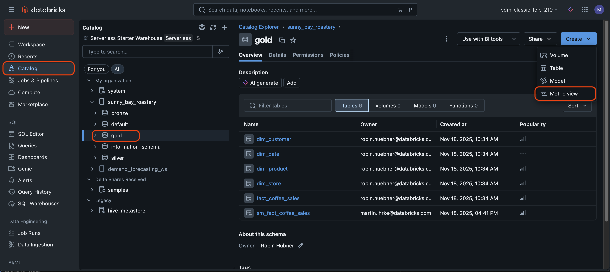

2. Input the name `sm_fact_coffee_sales` for Your Metric View

> [!NOTE]
> The `sm` prefix stands for **semantic model**. We avoid using `mv` as a prefix because it is commonly associated with **materialized views** in developer workflows.

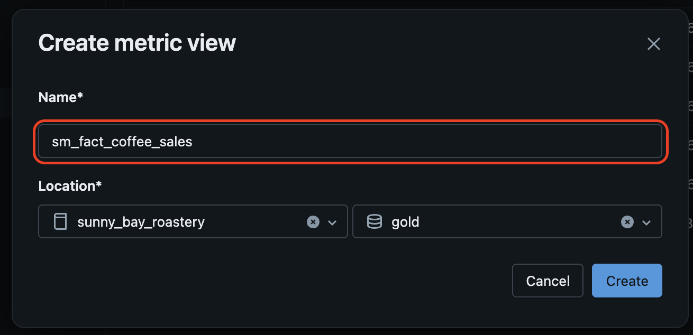

3. If the YAML editor opened, switch to the UI view. If the UI view opened, you can skip this step.

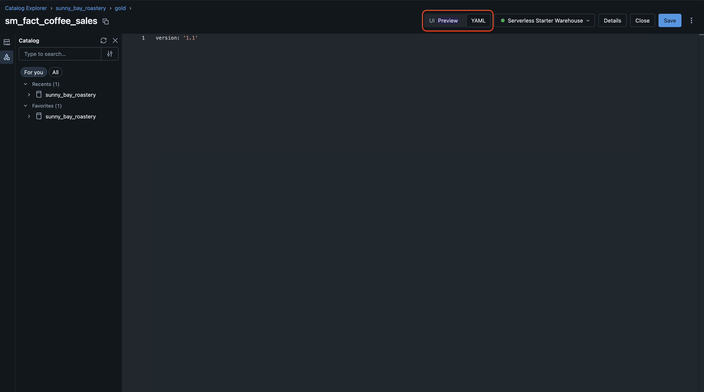

4. Click on `Select source` to choose the fact table.

5. You now need to navigate to your source table again which is again `sunny_bay_roastery.gold.fact_coffee_sales`. Navigate to it using the Unity Catalog hierarchie. Add it to the Metric View.

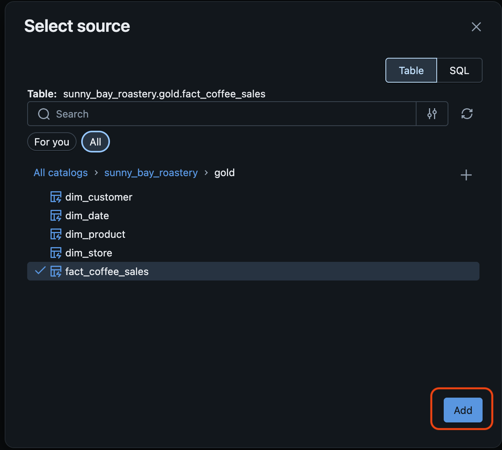

6. We will now create our first join. In the overview page, expand the Metric View Canvas by clicking the Arrow button and then click the Join button (2 circles)

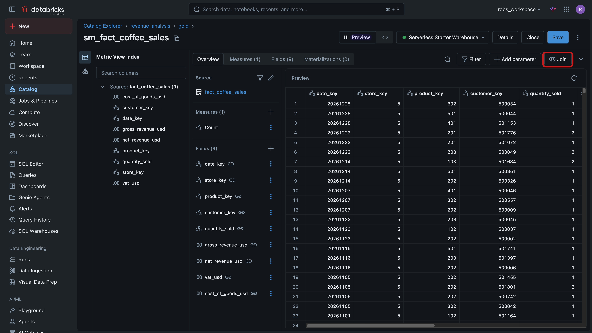

7. Add the `dim_product` table and define the Join Condition using the appropriate columns (see YAML for reference, if need).

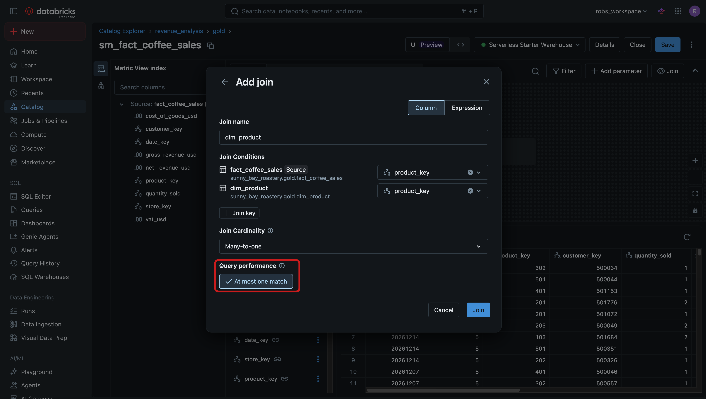

8. In the following dialog, only select the `Product Name`, `Product Subcategory` and `Product Category`attributes. 

9. See the results of your join-configuration. To get back to the overview page, click the back button. 

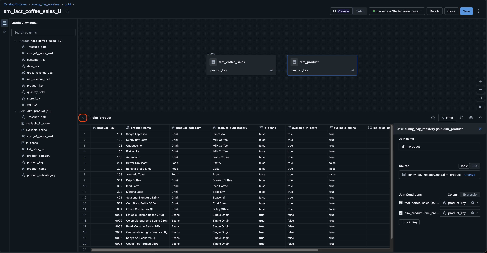

10. Here, delete all other ones, including those coming from the `fact_coffee_sales` table. 

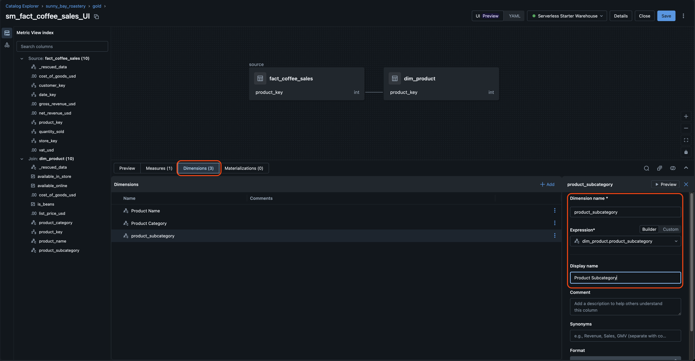

11. Create a few measures in the Measures section. You can use those expression that you created using the YAML part.

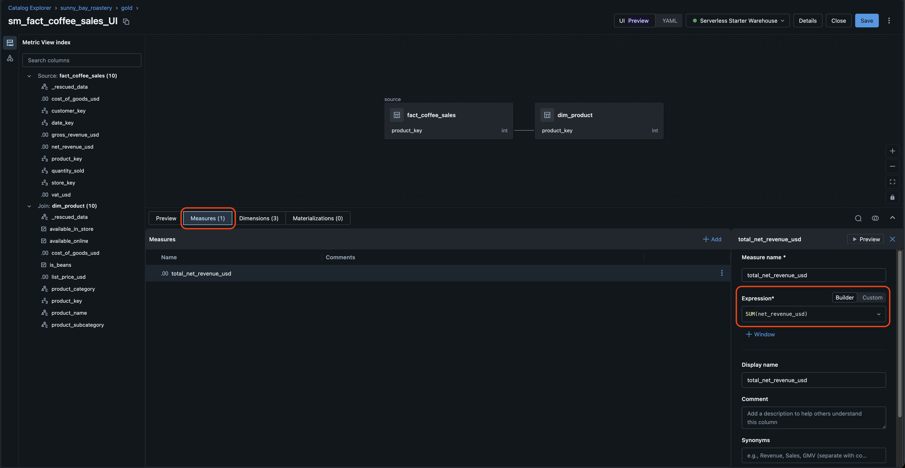

12. You can further play around the the UI to add more dimensions and measures. 

**TIP**: you can switch back and forth using the above mentioned switch at the top. To create exactly the same Metric View from above, you can copy the YAML definition over and see/change the results using the GUI. Finally, the Metric View that you defined above will look like this in the UI editor:

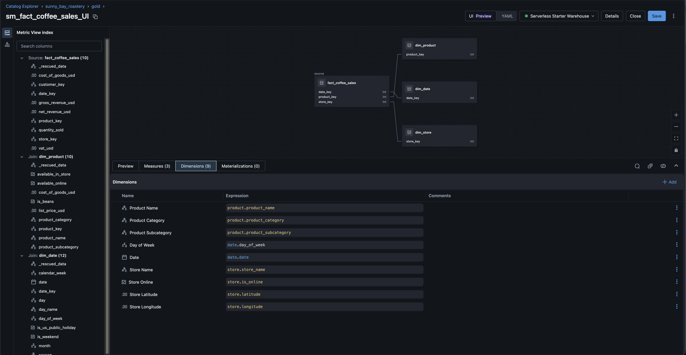


xxxxxxxxx

3. (Optional) In some cases, the editor defaults to the new UI editing mode, which is in preview. In this step, we will proceed with the YAML mode. If you see a "Select Source" dialog, close it for now...

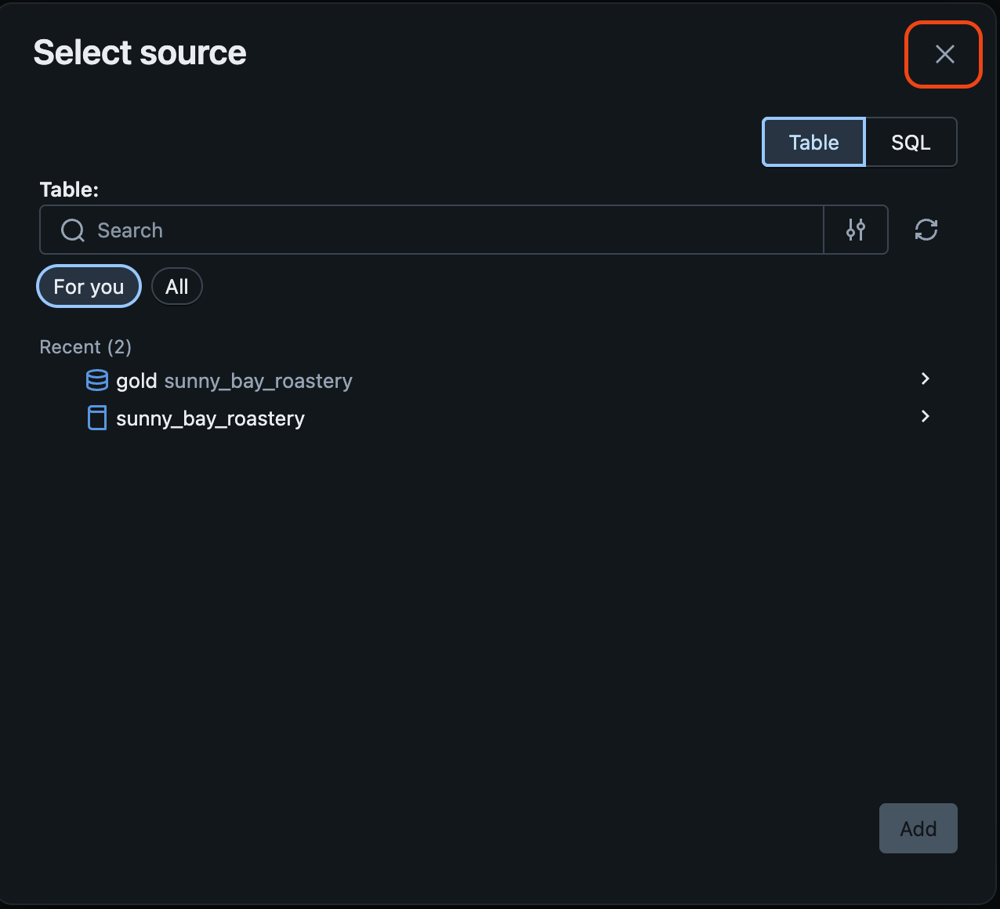

...and change the editor to the YAML mode. 


4. Delete all sample code, if any exists.

### Add source table and relationships to the Metric View

1. Define your source, which is the base table of the metric view and typically the fact table of our star/snowflake schema. In your case, this will be `sunny_bay_roastery.gold.fact_coffee_sales`. Copy the following code snippet to the top of your Metric View definition. Note that the version attribute determines which features are available. We will use version 1.1.

```YAML
version: 1.1

source: sunny_bay_roastery.gold.fact_coffee_sales 
```

2. Add your first join to a dimension table. Specify the **product** dimension the table `sunny_bay_roastery.gold.dim_product` and the join key `source.product_key = product.product_key` to define the relationship of the dimension table and the fact table.

```YAML
joins:
  - name: product
    source: sunny_bay_roastery.gold.dim_product
    "on": source.product_key = product.product_key
```
3. Add another join  using the same approach (the code snippet is not provided this time). Note that the `join` keyword needs to be used only once. Initiate the next join using the `-` sign and mind the formatting/indents (YAML can be tricky in that regard). Use your **date** dimension which is stored in the table `sunny_bay_roastery.gold.dim_date`. The join columns are named `date_key` on both tables. Set the name attribute to `date`.

4. Add a final join to the **store** dimension table named `sunny_bay_roastery.gold.dim_store`. The join columns are named `store_key` on both sides. Set the name attribute to `store`.

**Step 3: Define Dimensional Attributes**

1. Now that we have our joins defined, we can select which dimensional attributes our Metric View should contain. We can automatically select all attributes that exist by simply adding the table name as an expression which will add a array-column containing all attributes. However, this will bloat the model and add complexity that might not be helpful to end users. Instead you will select the product name by adding the follwing snippet:

```YAML
dimensions:
  - name: product_name
    expr: product.product_name
    display_name: Product Name
```

2. Now that we have defined at least one dimension attribute, we can save our progress and check for syntax errors. Make sure again that you provided the name **`sm_fact_coffee_sales`** and save the Metric View by clicking the Save button at the right top corner. If everything is defined correctly, the Metric View will be saved and is immediately available in Unity Catalog. 

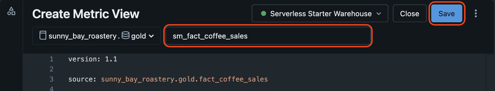

3. Add two more dimension attributes from the **product** dimension table. Select the following attributes: 
    - Product category (product.product_category)
    - Product subcategory (product.product_subcategory)
 
4. Since you also joined the **date** dimension table in the previous section, add the following dimension attributes:
    - Date (date.date)
    - Day of Week (date.day_of_week)

5. Finally, add the following attributes from the **store** dimension table:
    - Store Name (store.store_name)
    - Is Online Store (store.is_online)
    - Store Latitude (store.latitude)
    - Store Longitude (store.longitude)

6. Save your progress and troubleshoot your definition in case you see any errors.


**Step 4: Define Measures**

1. As the last step, create a basic measure which will sum the total net revenue. The approach is very similar to adding dimension attributes. Add the following code snippet to the buttom of your Metric View definition:
```YAML
measures:
  - name: total_net_revenue_usd
    expr: SUM(net_revenue_usd)
```

2. Add a second measure that will **sum** our cost of goods. The column that stores this metric is named `cost_of_goods_usd`. The name of the measure should be `total_cost_of_goods`.

3. We will add third measure named `total_net_profit`, that will substract the second measure `total_cost_of_goods` from the first measure `total_net_revenue_usd`. This will be our profit. The expression is `measure(total_net_revenue_usd) - measure(total_cost_of_goods)`.

4. Save your progress and troubleshoot your definition in case you see any errors.

**Step 5: Final Steps**

You have now published the Metric View to Unity Catalog by saving the YAML. This makes the metric view discoverable and available to teams and tools, including Databricks Dashboards and downstream analytics, provided they have access inherited from the schema. 

If you got any errors you couldn't resolve yourself, review the full definition and compare with your results:

```YAML
version: 1.1

source: sunny_bay_roastery.gold.fact_coffee_sales

joins:
  - name: product
    source: sunny_bay_roastery.gold.dim_product
    "on": source.product_key = product.product_key
  - name: date
    source: sunny_bay_roastery.gold.dim_date
    "on": source.date_key = date.date_key
  - name: store
    source: sunny_bay_roastery.gold.dim_store
    "on": source.store_key = store.store_key

dimensions:
  - name: product_name
    expr: product.product_name
    display_name: Product Name
  - name: product_category
    expr: product.product_category
    display_name: Product Category
  - name: product_subcategory
    expr: product.product_subcategory
    display_name: Product Subcategory
  - name: day_of_week
    expr: date.day_of_week
    display_name: Day of Week
  - name: date
    expr: date.date
    display_name: Date
  - name: store_name
    expr: store.store_name
    display_name: Store Name
  - name: store_online
    expr: store.is_online
    display_name: Store Online
  - name: store_latitude
    expr: store.latitude
    display_name: Store Latitude
  - name: store_longitude
    expr: store.longitude
    display_name: Store Longitude

measures:
  - name: total_net_revenue_usd
    expr: SUM(net_revenue_usd)
  - name: total_cost_of_goods
    expr: SUM(cost_of_goods_usd)
  - name: total_net_profit
    expr: measure(total_net_revenue_usd) - measure(total_cost_of_goods)
```

**(Optional) Step 6: GUI driven creation**

Databricks recently introduced a GUI to create Metric Views that will allow for a more convenient modelling approach. This is currently in Public Preview and still could change (hence the optional section). We will create the same Metric View from above in this section using the GUI driven approach.

1. Navigate to the `gold` schema and create a new Metric View as you did at the beginning of this Module. Provide a name of your choice. 

2. If the YAML editor opened, switch to the UI view. If the UI view opened, you can skip this step.


3. You now need to navigate to your source table again which is again `sunny_bay_roastery.gold.fact_coffee_sales`. Navigate to it using the Unity Catalog hierarchie. Add it to the Metric View.


4. We will now create our first join. In the overview page, expand the Metric View Canvas by clicking the Arrow button and then click the Join button (2 circles)


5. Add the `dim_product` table and define the Join Condition using the appropriate columns (see YAML for reference, if need).


6. In the following dialog, only select the `Product Name`, `Product Subcategory` and `Product Category`attributes. 

7. See the results of your join-configuration. To get back to the overview page, click the back button. 


8. Here, delete all other ones, including those coming from the `fact_coffee_sales` table. 


9. Create a few measures in the Measures section. You can use those expression that you created using the YAML part.


10. You can further play around the the UI to add more dimensions and measures. 

**TIP**: you can switch back and forth using the above mentioned switch at the top. To create exactly the same Metric View from above, you can copy the YAML definition over and see/change the results using the GUI. Finally, the Metric View that you defined above will look like this in the UI editor:


You can save or abandon the Metric View you just created. We don't need it in the subsequent steps. The point of that excercise was to introduce the Metric View GUI.


## What Happens Next?

You created a simple Metric View and users will be able to directly query business metrics without writing SQL joins or recalculating KPIs.

On purpose, you did not yet use any advanced features such as complex calulations, synomyns, formatting, etc. We encourage you to look into more advanced calculations and modelling capabilites such as:

**Different aggregation functions:**
```YAML 
  - name: max_net_revenue_usd
    expr: MAX(net_revenue_usd)
  - name: avg_cost_of_goods
    expr: AVG(cost_of_goods_usd)
```
    
**Windowing calcuations such as rolling averages, previous periods and running totals:**
```YAML 
  - name: total_gross_revenue_usd_previous_day
    expr: measure(`total_gross_revenue_usd`)
    window:
      - order: date_date
        semiadditive: last
        range: trailing 1 day
```
**Number formatting and synomyns:**
```YAML
  - name: total_gross_revenue_usd
    expr: SUM(`gross_revenue_usd`)
    comment: Total gross revenue in USD before VAT and costs
    display_name: Total Gross Revenue (USD)
    format:
      type: currency
      currency_code: USD
      decimal_places:
        type: exact
        places: 2
      abbreviation: compact
    synonyms:
      - revenue
      - gross revenue
```

> [!NOTE]
> A richer metric view named `sm_fact_coffee_sales_genie` has already been pre-deployed to your catalog. It includes additional customer dimensions, formatting, synonyms, and windowed measures — providing richer context for AI agents. You can explore it in your catalog at `<catalog>.gold.sm_fact_coffee_sales_genie`.

Once you explored the Metric Views in Unity Catalog, proceed to the next section.
