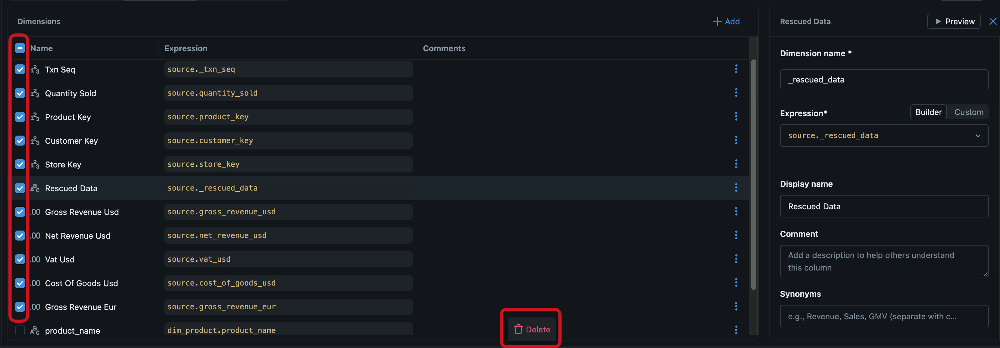
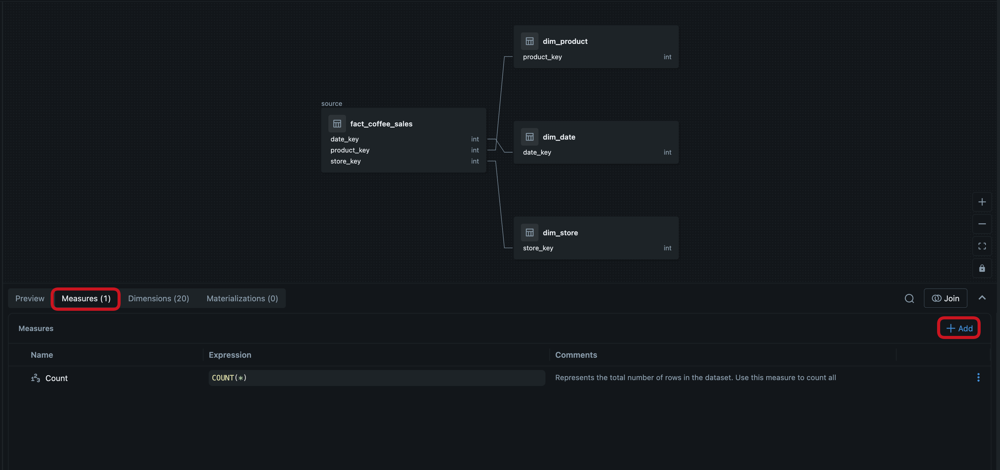
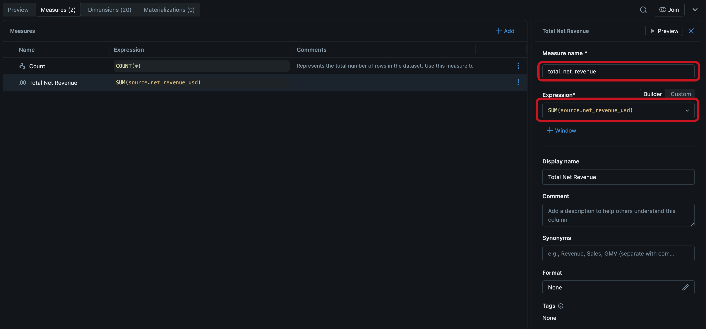

# ☕ Lab 2 – Data Modelling: Bring Context and Business Semantics to your data

## 🎯 Learning Objectives
By the end of this lab, you will:
- Understand how [Databricks Metric Views](https://learn.microsoft.com/azure/databricks/metric-views/) will allow you to add business semantics using relationships and calculations to your data
- Create a metric view with
    - relationships to our tables to allow implicit joining of tables.
    - dimensions and measures with attributes and common calcutions
    - formating instructions and synomyns
- Publish the metric view to make it available in Unity Catalog to make it accessable by subsequent features and tools such as Databricks Dashboards.

## Introduction

**What Are Metric Views?**

Metric views are reusable semantic models in Databricks that define business logic for KPIs, calculations, joins, and dimensions in a standardized way.

They allow consistent reporting, simplify complex SQL logic, and centralize metric definitions for dashboards, notebooks, and BI tools.​

**Why Use Metric Views?**

- Ensure “one version of the truth” by standardizing metrics and calculations organization-wide.

- Enable flexible exploration of metrics across any dimension (e.g., sales by product, region, or time) without rebuilding SQL queries.

- Simplify maintenance—updates to metrics or logic are immediately available across all downstream reports and tools.

- Add business context via synonyms, comments, and formatting for user-friendly analytics.​


## Instructions

**Step 1: Create an Empty Metric View**


1. Navigate to the gold schema using the Catalog Explorer and create a new Metric View by selecting it after clicking the New Button.


2. Input the name `sm_fact_coffee_sales` for Your Metric View

> [!NOTE]
> The `sm` prefix stands for **semantic model**. We avoid using `mv` as a prefix because it is commonly associated with **materialized views** in developer workflows.


3. If the YAML editor opened, switch to the UI view. If the UI view opened, you can skip this step.


4. Click on `Select source` to choose the fact table.

5. You now need to navigate to your source table again which is again `sunny_bay_roastery.gold.fact_coffee_sales`. Navigate to it using the Unity Catalog hierarchie. Add it to the Metric View.


**Step 2: Add Joins to Dimension Tables**

> [!NOTE]
> Joins link your fact table to dimension tables, allowing users to slice and filter metrics by attributes like product name, store location, or date — e.g., "show revenue by product category."

1. We will now create our first join. In the overview page, expand the Metric View Canvas by clicking the Arrow button and then click the Join button (2 circles)


2. Add the `dim_product` table and define the Join Condition using the appropriate columns (see YAML for reference, if need).


3. In the following dialog, only select the `Product Name`, `Product Subcategory` and `Product Category`attributes. 

4. See the results of your join-configuration. To get back to the overview page, click the back button. 


5. Now add the remaining dimension tables using the same approach. Use the following table as a reference:

| Dimension Table | Join Condition | Dimensions to Select |
|---|---|---|
| `dim_date` | `source.date_key = date.date_key` | Date, Day of Week |
| `dim_store` | `source.store_key = store.store_key` | Store Name, Is Online, Latitude, Longitude |

> [!TIP]
> If you are curious about other dimensions, you can of course select them as well.

6. Here, delete all other ones, including those coming from the `fact_coffee_sales` table. You can delete the dimensions in bulk.

> [!NOTE]
> It is best practice to hide non-relevant and technical columns from business users who consume metric views. This keeps the model clean and easy to navigate.




7. Congratulations for creating the basic semantic model of Sunny Bay Roastery. In the next step we are going to integrate measures.


**Step 3: Add Measures**

> [!NOTE]
> Measures define the calculations that business users can query — e.g., `SUM(net_revenue_usd)` to get total revenue across any combination of dimensions.

1. Now, we are going to create three measures for `total_net_revenue_usd`, `total_cost_of_goods`, and `total_net_profit`.

2. Open `Measures` and click on `+ Add`. 



3. Enter the measure name `total_net_revenue_usd` and the expression `SUM(net_revenue_usd)`. You can optionally add more context such as synonyms, comments, and formats. It helps humans to understand the meaning (and agents as well).



4. Now apply the exact same step for the other two measures:
   - `total_cost_of_goods` with expression `SUM(cost_of_goods_usd)`
   - `total_net_profit` with expression `measure(total_net_revenue_usd) - measure(total_cost_of_goods)`

5. Try creating a new measure using **Genie Code**. Click on `+ Add` and select `Generate with Genie Code`. Describe the measure you want in natural language — for example, "average revenue per order". This is especially helpful for building complex measures without writing the expression from scratch.

**TIP**: you can switch back and forth using the above mentioned switch at the top. To create exactly the same Metric View from above, you can copy the YAML definition over and see/change the results using the GUI. Finally, the Metric View that you defined above will look like this in the UI editor:


**Step 5: Final Steps**
1. Click on `Save`.

2. You have now published the Metric View to Unity Catalog by saving the YAML. This makes the metric view discoverable and available to teams and tools, including Databricks Dashboards and downstream analytics, provided they have access inherited from the schema. 

2. If you got any errors you couldn't resolve yourself, review the full definition and compare with your results:

```YAML
version: 1.1

source: sunny_bay_roastery.gold.fact_coffee_sales

joins:
  - name: product
    source: sunny_bay_roastery.gold.dim_product
    "on": source.product_key = product.product_key
  - name: date
    source: sunny_bay_roastery.gold.dim_date
    "on": source.date_key = date.date_key
  - name: store
    source: sunny_bay_roastery.gold.dim_store
    "on": source.store_key = store.store_key

dimensions:
  - name: product_name
    expr: product.product_name
    display_name: Product Name
  - name: product_category
    expr: product.product_category
    display_name: Product Category
  - name: product_subcategory
    expr: product.product_subcategory
    display_name: Product Subcategory
  - name: day_of_week
    expr: date.day_of_week
    display_name: Day of Week
  - name: date
    expr: date.date
    display_name: Date
  - name: store_name
    expr: store.store_name
    display_name: Store Name
  - name: store_online
    expr: store.is_online
    display_name: Store Online
  - name: store_latitude
    expr: store.latitude
    display_name: Store Latitude
  - name: store_longitude
    expr: store.longitude
    display_name: Store Longitude

measures:
  - name: total_net_revenue_usd
    expr: SUM(net_revenue_usd)
  - name: total_cost_of_goods
    expr: SUM(cost_of_goods_usd)
  - name: total_net_profit
    expr: measure(total_net_revenue_usd) - measure(total_cost_of_goods)
```

## What Happens Next?

You created a simple Metric View and users will be able to directly query business metrics without writing SQL joins or recalculating KPIs.

On purpose, you did not yet use any advanced features such as complex calulations, synomyns, formatting, etc. We encourage you to look into more advanced calculations and modelling capabilites such as:

**Different aggregation functions:**
```YAML 
  - name: max_net_revenue_usd
    expr: MAX(net_revenue_usd)
  - name: avg_cost_of_goods
    expr: AVG(cost_of_goods_usd)
```
    
**Windowing calcuations such as rolling averages, previous periods and running totals:**
```YAML 
  - name: total_gross_revenue_usd_previous_day
    expr: measure(`total_gross_revenue_usd`)
    window:
      - order: date_date
        semiadditive: last
        range: trailing 1 day
```
**Number formatting and synomyns:**
```YAML
  - name: total_gross_revenue_usd
    expr: SUM(`gross_revenue_usd`)
    comment: Total gross revenue in USD before VAT and costs
    display_name: Total Gross Revenue (USD)
    format:
      type: currency
      currency_code: USD
      decimal_places:
        type: exact
        places: 2
      abbreviation: compact
    synonyms:
      - revenue
      - gross revenue
```

> [!NOTE]
> A richer metric view named `sm_fact_coffee_sales_genie` has already been pre-deployed to your catalog. It includes additional customer dimensions, formatting, synonyms, and windowed measures — providing richer context for AI agents. You can explore it in your catalog at `<catalog>.gold.sm_fact_coffee_sales_genie`.

Once you explored the Metric Views in Unity Catalog, proceed to the next section.
