# 🧪 Lab 3 – Creating an AI/BI Dashboard

## 🎯 Learning Objectives

By the end of this lab, you will be able to:

- Use a Databricks metric view as the primary semantic source for dashboard visuals.
- Build interactive AI/BI dashboards with charts, filters, drill-downs, and summary tiles.
- Configure page-level and global filters (date, store, product) to enable rich interactivity.
- Leverage AI-assisted visual creation with natural-language prompts to accelerate dashboard building.

Your final dashboard should look like this:

  

## Introduction

**What Are AI/BI Dashboards?**

AI/BI Dashboards in Databricks are interactive, web-based reports that combine tables, charts, filters, and text into a single, shareable view. They run directly on governed datasets such as Unity Catalog metric views, and support AI-assisted visual creation, cross-filtering, drill-through, and global filters.

## Instructions

Before you start, please verify:
- The **Sunny Bay Coffee Sales Metric View** `sm_fact_coffee_sales` from Lab 2 is created and published in Unity Catalog.

**Step 1: Open the AI/BI Dashboard Template**

AI/BI Dashboards can be stored as a templates which contain the corporate identity, logos, and more elements that should be standardized.

1. In the Databricks workspace, open **Dashboards** from the left navigation.
2. Open the Dashboard "[Template] Sunny Bay Roastery - Sales Report"
3. You are now viewing the Dashboard from the perspective of a **Dashboard Consumer**
4. Click on "Edit Draft" to switch to the **Dashboard Creator** perspective

  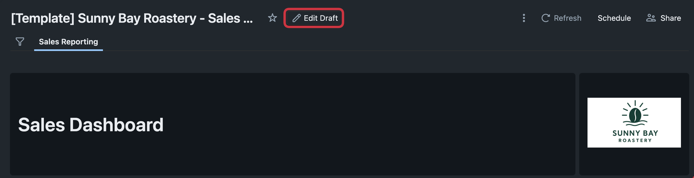

**Step 2: Configure the Metric View as a Data Source**

Every AI/BI Dashboard must have one or more data sources, which are used to create the visualizations.

1. Click on the "Data" tab to select the source data for the Dashboard
2. Click on "Add data source", and select the Metric View from Lab 2 as the data source

  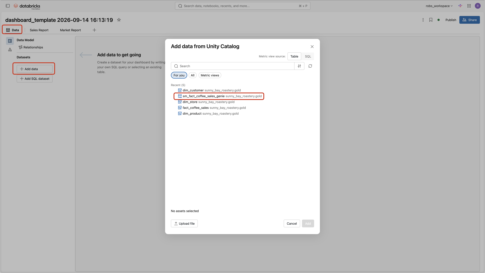

**Step 3: Add a Global Filter**

Global filters are helpful to apply a filter for multiple report pages. We are going to filter out all the sales before 2015.

1. Click on the "Show Global Filters" icon

  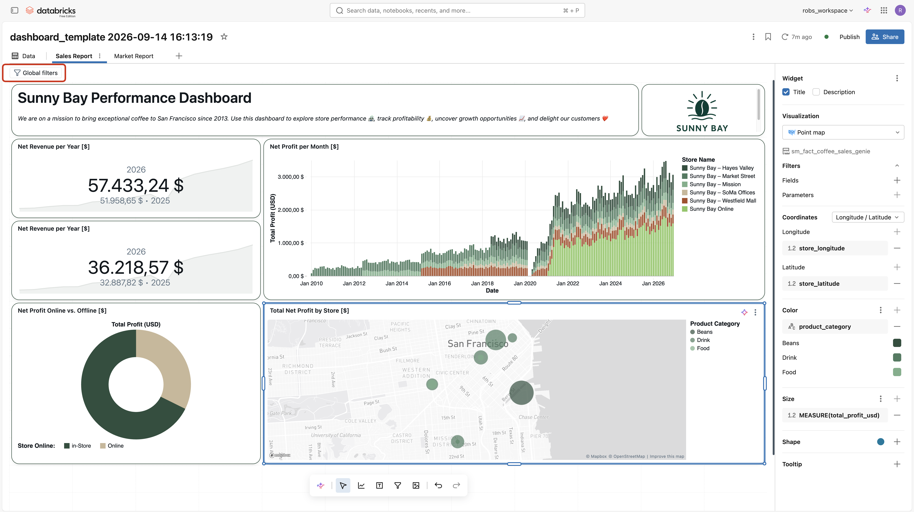

2. Click on the "+" icon to add a new global filter widget
3. Select the `Date Range Picker` as the filter type
4. Choose `date` as a field
5. Rename the widget from `date` to `Date`
6. Change the Default Value from `Jan 01, 2015` to `Dec 31, 2025`, which will become the default for the global filter

  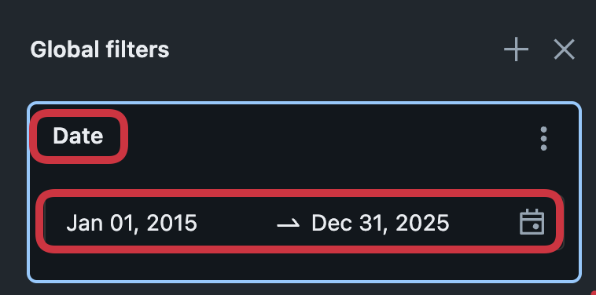

7. Minimize the global filters by clicking on "Hide Global Filters"

> 💡 Default filter values limit the data loaded on initial render, improving dashboard performance and ensuring users always start with a meaningful, pre-scoped view of the data.

---

**Step 4: Add a Page Level Filter for Store Name, Product Category, and Product Subcategory**

In this step, you will add page-level filters for store and product to enable interactive exploration for business users.

1. Click on the `Add a filter` icon

  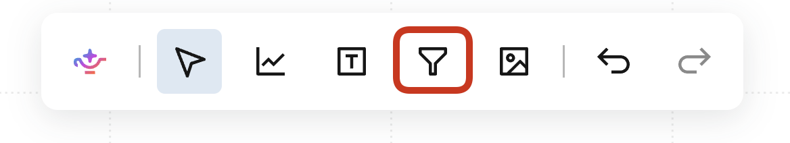

2. Select `Multiple values` as the filter type in the widget settings
3. Choose the value `store_name` in the fields selection
4. Rename the title from `store_name` to `Store Name`
5. Duplicate the filter widget twice, by selecting it, pressing `CTRL + C`, and `CTRL + V`
6. Rename the first duplicate to `Category`, remove the existing value from fields, and select `product_category`
7. Rename the second duplicate to `Subcategory`, remove the existing value from fields, and select `product_subcategory`
8. Take a moment to explore the filters — click through the dropdowns to familiarize yourself with the available stores and products.
9. Select `Beans` as the `Category` and notice how the `Subcategory` filter automatically updates to only show relevant options — this is cascading filters in action.

  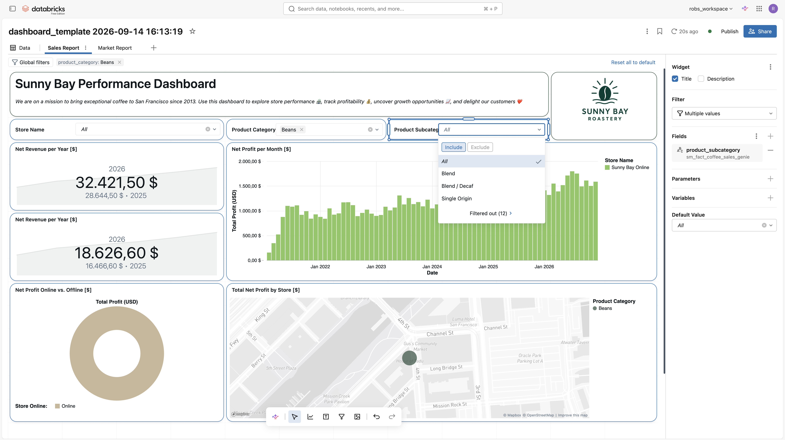

**Step 5: Add Section Headers**

Text widgets can be used as section headers to structure your dashboard into logical sections.

1. Click the `Add a text box` icon to add a new text widget
2. Enter `## Financial Highlights` as the text and format it as a **Heading**
3. Resize the text box to span the full width of the dashboard and reduce the height to a single row
4. Repeat the same steps to create two more section headers:
   - `## Sales by Location & Channel`
   - `## Deep Dive`

5. Move the section headers to the correct position above each section of your dashboard. Your final structure should look like this:

   - 📌 **Financial Highlights** → above the KPI counters and bar chart
   - 📌 **Sales by Location & Channel** → above the donut chart and map
   - 📌 **Deep Dive** → above the pivot/detail table

**Step 6: Add KPI Counter Visuals for Revenue and Profit**

Counter visuals allow you to display a key metric for the current period alongside a comparison to a previous period.

1. Click the `Add a visualization` icon to add a new widget to the dashboard

  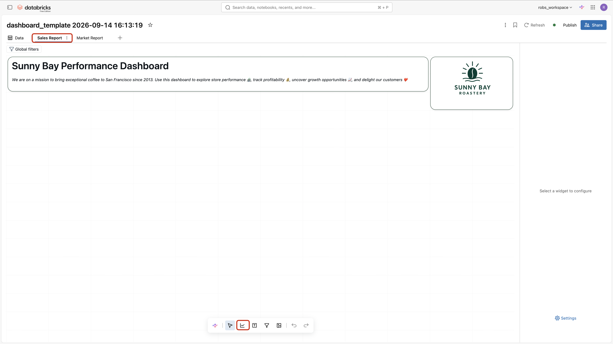

2. Select **`Counter`** as the visualization type

3. Enable the **Title** checkbox and enter `Net Revenue per Year [$]`

4. Resize the widget to a width of `4` and a height of `3`

5. Under **Date**, click **"+"** and select `YEARLY(date)`

6. Under **Value**, click **"+"** and select `MEASURE(total_net_revenue_usd)`

7. Under **Comparison**, click **"+"** and select `MEASURE(total_net_revenue_usd)` again. Set **Years ago offset** to `1` and set **Change** format to `%`

8. Click on the value field `MEASURE(total_net_revenue_usd)` and navigate to the **Format** and **Custom** tab. Set the following:
   - **Type:** `$`
   - **Currency:** `US-Dollar ($)`
   - **Decimal places:** `Exact` → `0`
   - **Group separator:** ✅ enabled

9. Your counter visual should now show the current year's net revenue with a year-over-year comparison

10. To create the second counter, right-click the widget and select **"Duplicate"**. Update the following settings in the copy:
   - **Title:** `Net Profit per Year [$]`
   - **Value:** change to `MEASURE(total_net_profit)`
   - **Comparison:** change to `MEASURE(total_net_profit)`

**Step 7: Create Your First AI-Assisted Bar Chart**

Genie Code can generate visuals directly from natural language prompts.

1. Click the `Add a visualization` icon to add a new widget to the dashboard
2. Ask the AI Assistant in the visualization to "_Create a bar chart that shows the net profit over date aggregated by month_"

  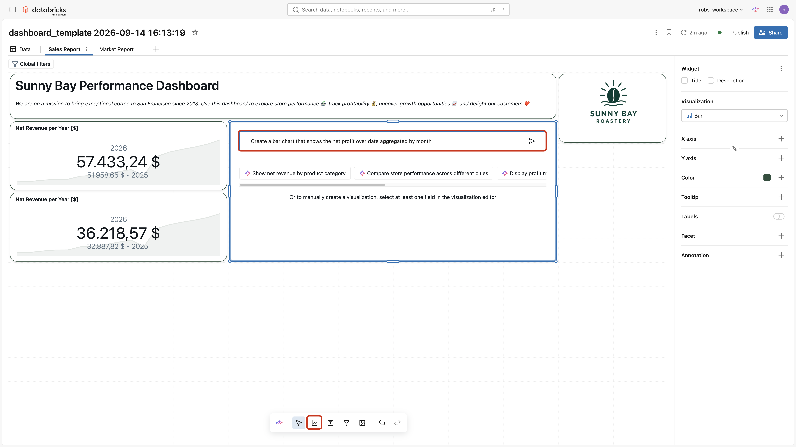

3. Press "Accept" when you are satisfied with the visualization. If not, press "Reject", and refine the prompt.

  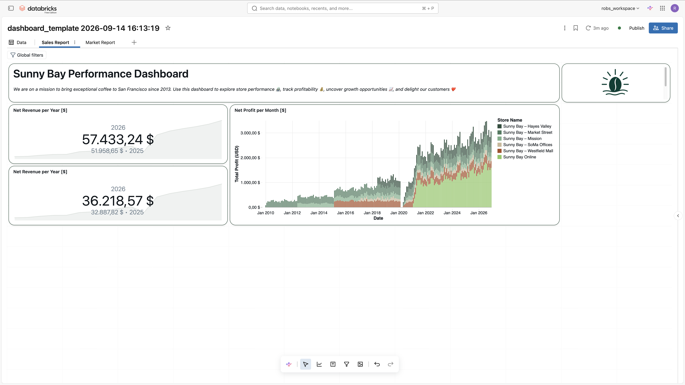

4. Change the format of the Net Profit to the type "$" with no decimal places.

  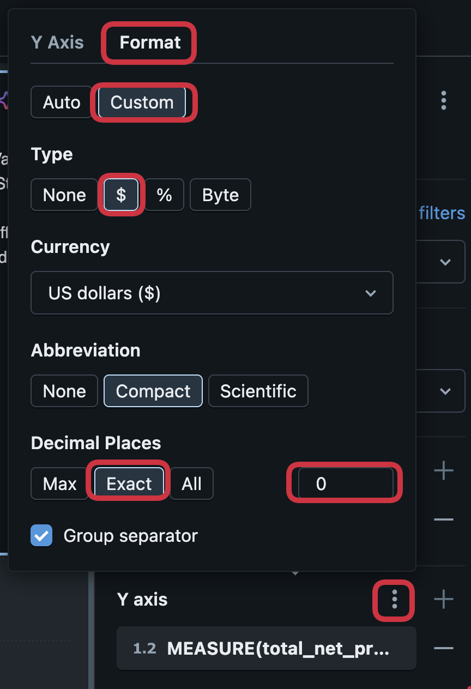

5. Rename the axis title to "Net Profit [$]"
6. To group the sales by store, click on the "+" next to the "Color" field in the widget settings, and choose the value "store_name"

  

7. Add the measures "total_cost_of_goods" and "total_net_revenue_usd" as tooltip
8. Rename the tooltip values to "Total Costs of Goods [$]" and "Total Net Revenue [$]"
9. Rename the title to "Net Profit per Month [$]"

Your dashboard should look like this:

  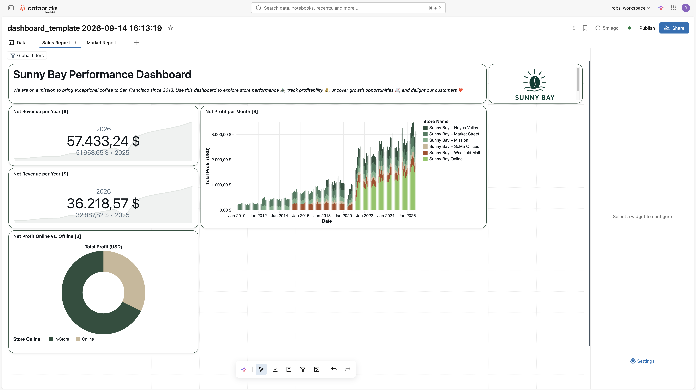

**Step 8: Create a Pie Chart and Explore Cross-Filtering**

1. Make sure that all report level filters are not applied
2. Create a new visualization by clicking on `Add visualization`
3. Select the `Pie` as visualization type
4. Add the title to `Net Profit Online vs. Offline [$]`
5. Choose the `total_net_profit` as the `angle`, and `store_online` as the `color`
6. Select your prefered colors for the values `true`, and `false` 
7. Open the formatting of Color, and add the aliases "Online" and "In-Store"
8. Rename the angle `Display name` to "Net Profit [$]"
9. Activate labels for this visualization 
10. Click on the one of the values of the pie chart, and see how the cross-filtering functionality effects the bar chart

  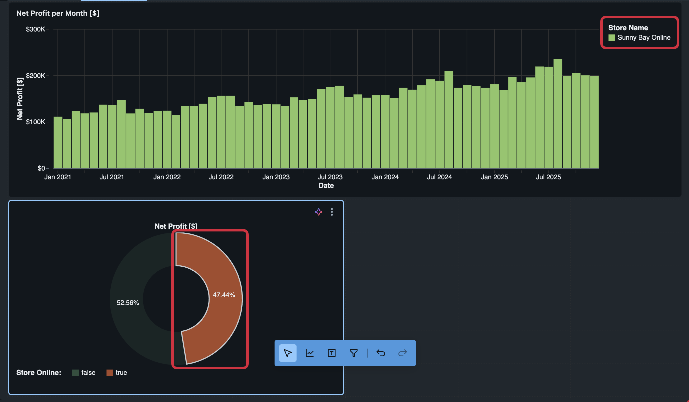

**Step 9: Create a Map Visualization**

1. Create a new visualization by clicking on `Add visualization`
2. Select `Point map` as `visualization type`
3. Add the title `Total Net Profit by Store [$]`
4. Select the dimensions `store_latitude`, and `store_longitude` for the coordinates
5. Choose the measure `total_net_profit` as the size
6. Use the dimension `product_category` as the color
7. Rename the color's `Legend title` to `Product Category`
8. Click on the kebab menu of the map visual and click on `View fullscreen`

  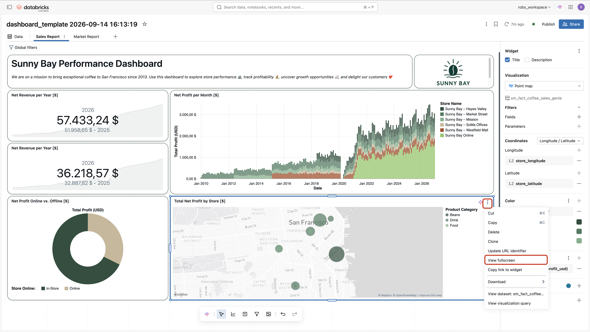

**Step 10: Add a Pivot Table for Detailed Sales Breakdown**

Pivot tables allow you to explore your data across multiple dimensions simultaneously — perfect for a detailed breakdown of revenue by store and product.

1. Navigate to the **"Sales Report"** tab and scroll down to the **"Deep Dive"** section
2. Click the **"Add a visualization"** icon and select **"Pivot"** as the visualization type
3. Rename the title to `Revenue Breakdown by Store & Product [$]`
4. Select `sm_fact_coffee_sales` as the dataset
5. Add a visual filter to limit the date range:
   - Click **"+"** next to **Filter fields**
   - Select `date` as the filter field
   - Set the range from `01 January 2020` to `31 December 2025`

6. Under **Rows**, click **"+"** and select `store_name`

7. Under **Columns**, click **"+"** and add the following in order:
   - `product_category`
   - `product_subcategory`

8. Click on `product_category` in the columns and enable the **"Display total"** checkbox

9. Under **Values**, click **"+"** and select `MEASURE(total_net_revenue_usd)`
   - Change the **Display name** to `Total Net Revenue`
   - Navigate to the **Format** tab and configure:
     - **Type:** `$`
     - **Currency:** `US-Dollar ($)`
     - **Decimal places:** `Exact` → `0`

10. Your pivot table should now show net revenue broken down by store (rows) and product category/subcategory (columns)

**Step 11: Explore the Drill-Through Feature**

1. Open the "Market Report" page of the report
2. Copy the page-level filters from the `Sales Report`
3. Create a new visualization by clicking on `Add visualization`
4. Select the visualization type `Heatmap`
5. Choose `day_of_week` for the x-axis, and `product_name` for the y-axis
6. Select `total_net_profit` as the color
7. Activate labels for this visualization
8. Rename the value to "Net Profit by Day of Week and Product [$]"
9. Change the x-axis scale type to `categorical`
10. Jump back to `Sales Report` page
11. Drill into the market report by rightclicking on the value for one store, clicking `drill to`, and `Market Report` 

  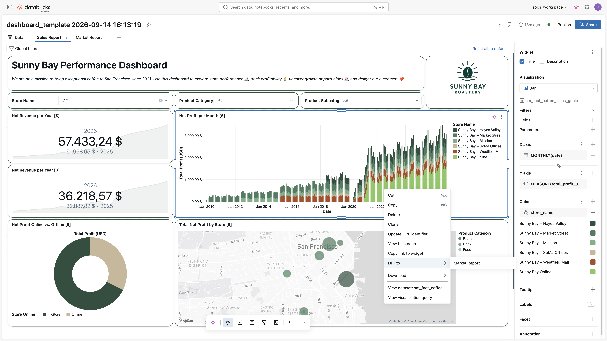

12. The filter is propagated to the `Market Report`, and the revenue for each product grouped by day of the week is displayed
13. Reset the filter by clicking `Reset all to default`

**Step 12: Publish the Report**

1. Congratulations, the report is ready for production. Click on `Publish` to make the report available for report consumers. 

  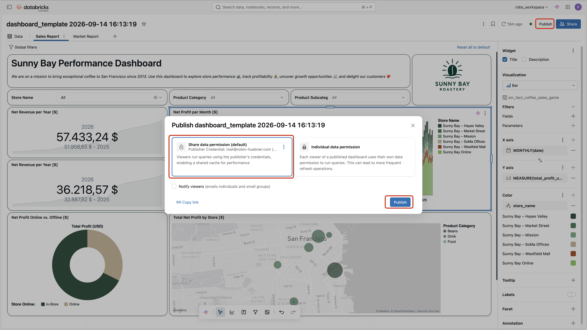

2. Select the `Individual data permissions` and click publish
3. Click on the `View Published` button to switch to the perspective of a **Dashboard Consumer**
4. Download the Dashboard as a PDF by clicking on the kebab menu and `Download as PDF`

**Step 13: View the Report as a Consumer**

1. Open the Databricks One UI

  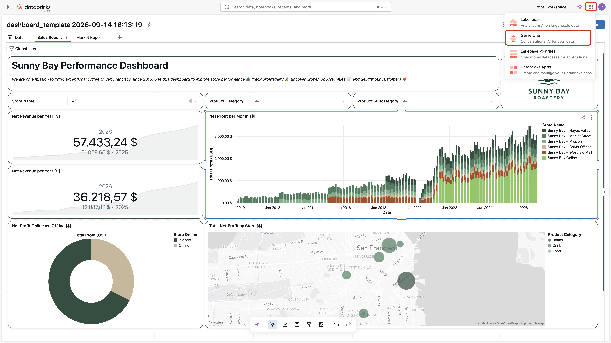

2. Search for the report, or click on `Dashboards` to find all available dashboards

## What Happens Next?

You have now created a production-ready AI/BI Dashboard for Sunny Bay Roastery, powered by the `sm_fact_coffee_sales` metric view.  
Business users can:

- Filter by store and product to answer ad-hoc questions.
- Use cross-filtering and drill-through for deeper analysis.
- Access the report in Databricks One UI as dashboard consumers.
