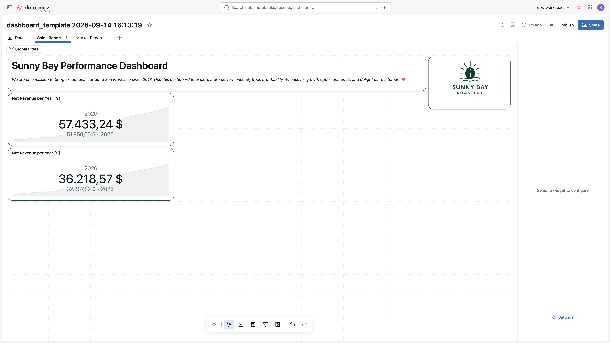

# 🧪 Lab 3 – Creating an AI/BI Dashboard

## 🎯 Learning Objectives

By the end of this lab, you will be able to:

- Use a Databricks metric view as the primary semantic source for dashboard visuals.
- Build interactive AI/BI dashboards with charts, filters, drill-downs, and summary tiles.
- Leverage Genie Code to create visuals from natural-language prompts, including a fully custom Vega-Lite visualization.
- Configure page-level and global filters (date, store, product) to enable rich interactivity.
- Ask Genie questions directly on a published dashboard and share it with business consumers.

Your final dashboard should look like this:

  

## Introduction

**What Are AI/BI Dashboards?**

AI/BI Dashboards in Databricks are interactive, web-based reports that combine tables, charts, filters, and text into a single, shareable view. They run directly on governed datasets such as Unity Catalog metric views, and support AI-assisted visual creation, cross-filtering, drill-through, and global filters.

> [!TIP]
> This lab builds on the pre-deployed **`sm_fact_coffee_sales_genie`** metric view, and we recommend using it: its KPIs already carry the right currency and number **formats**, so your dashboard visuals inherit them and you never format a measure by hand. If you prefer, you can point the dashboard at the **`sm_fact_coffee_sales`** view you built in Lab 2 instead — the steps are the same (only the profit measure is named `total_net_profit_usd` there instead of `total_profit_usd`).

## Instructions

Before you start, please verify:
- The **`sm_fact_coffee_sales_genie`** metric view exists in Unity Catalog (it was pre-deployed in Lab 0). *(You can also use the `sm_fact_coffee_sales` view you built in Lab 2.)*
- A **SQL warehouse** (Pro or serverless) is available for running dashboard queries.

> [!TIP]
> This lab is organized into four parts. First you **build** the visuals so you see results quickly, then you **make them interactive** with filters and drill-through, then you **share and consume** the report, and finally there are optional **add-on** tasks for anyone who finishes early.
> - **Part A – Build the Dashboard (Visuals First)**
> - **Part B – Make It Interactive (Filters, Headers, Drill-Through)**
> - **Part C – Share, Consume & Ask**
> - **Part D – Add-On Tasks (Optional)**

### 🏗️ Part A – Build the Dashboard (Visuals First)

**Step 1: Open Your Dashboard and Switch to Edit Mode**

Lab 0 created an editable dashboard for you named **Sunny Bay Roastery - Sales Report**. It is a branded starting point (title, description, and logo are already in place) that carries the corporate identity so your report looks consistent, and it is your own copy, so you have full edit rights. A read-only **[Final]** version is also deployed as a reference you can compare against at the end.

1. In the Databricks workspace, open **Dashboards** from the left navigation.

2. Open the Dashboard "Sunny Bay Roastery - Sales Report" — because it is your own draft, it opens directly in the **Dashboard Creator** (edit) view, ready for you to build on.

**Step 2: Configure the Metric View as a Data Source**

Every AI/BI Dashboard must have one or more data sources, which are used to create the visualizations.

1. Click on the "Data" tab to select the source data for the Dashboard

2. Click on "Add data source", and select the **`sm_fact_coffee_sales_genie`** metric view as the data source (or the `sm_fact_coffee_sales` view from Lab 2 if you prefer)

  

**Step 3: Add KPI Counter Visuals for Revenue and Profit**

Counter visuals allow you to display a key metric for the current period alongside a comparison to a previous period. Let's start here so you have a visual on the canvas right away.

1. Navigate to the **"Sales Report"** tab and click the `Add a visualization` icon to add a new widget to the dashboard

  

2. Select **`Counter`** as the visualization type

3. Enable the **Title** checkbox and enter `Net Revenue per Year [$]`

4. Resize the widget to a width of `4` and a height of `3`

5. Under **Date**, click **"+"** and select `YEARLY(Date)`

6. Under **Value**, click **"+"** and select `Total Net Revenue (USD)`

7. Under **Comparison**, click **"+"** and select `Total Net Revenue (USD)` again. Set **Years ago offset** to `1` and set **Change** format to `%`

8. Your counter visual should now show the current year's net revenue with a year-over-year comparison — already formatted as currency, because the format is defined on the metric view.

9. To create the second counter, right-click the widget and select **"Clone"**. Update the following settings in the copy:
   - **Title:** `Net Profit per Year [$]`
   - **Value:** change to `Total Profit (USD)`
   - **Comparison:** change to `Total Profit (USD)`

  

**Step 4: Create an AI-Assisted Bar Chart with Genie Code**

Genie Code can generate visuals directly from natural-language prompts.

1. Click the `Add a visualization` icon to add a new widget to the dashboard

2. Ask **Genie Code** in the visualization to "_Create a bar chart that shows the net profit over date aggregated by month_"

  

3. Press "Accept" when you are satisfied with the visualization. If not, press "Reject", and refine the prompt.

  

4. Rename the axis title to "Net Profit [$]"

5. To group the sales by store, click on the "+" next to the "Color" field in the widget settings, and choose the value `Store Name`

  

6. Add the measures `Total Cost of Goods Sold (USD)` and `Total Net Revenue (USD)` as tooltip

7. Rename the tooltip values to "Total Costs of Goods [$]" and "Total Net Revenue [$]"

8. Rename the title to "Net Profit per Month [$]"

Your dashboard should look like this:

  

**Step 5: Create a Pie Chart and Explore Cross-Filtering**

1. Create a new visualization by clicking on `Add visualization`

2. Select the `Pie` as visualization type

3. Add the title to `Net Profit Online vs. Offline [$]`

4. Choose `Total Profit (USD)` as the `angle`, and `Store Online` as the `color`

5. Select your preferred colors for the values `true`, and `false`

6. Open the formatting of Color, and add the aliases "Online" and "In-Store"

7. Rename the angle `Display name` to "Net Profit [$]"

8. Activate labels for this visualization

9. Click on one of the values of the pie chart, and see how the cross-filtering functionality affects the bar chart

**Step 6: Create a Map Visualization**

1. Create a new visualization by clicking on `Add visualization`

2. Select `Point map` as `visualization type`

3. Add the title `Total Net Profit by Store [$]`

4. Select the dimensions `Store Latitude`, and `Store Longitude` for the coordinates

5. Choose the measure `Total Profit (USD)` as the size

6. Use the dimension `Product Category` as the color

7. Click on the kebab menu of the map visual and click on `View fullscreen`

  

**Step 7: Add a Pivot Table for Detailed Sales Breakdown**

Pivot tables allow you to explore your data across multiple dimensions simultaneously — perfect for a detailed breakdown of revenue by store and product.

1. Scroll down to the bottom of the **"Sales Report"** tab, where the **"Deep Dive"** section will live

2. Click the **"Add a visualization"** icon and select **"Pivot"** as the visualization type

3. Rename the title to `Revenue Breakdown by Store & Product [$]`

4. Select `sm_fact_coffee_sales_genie` as the dataset

5. Add a visual filter to limit the date range:
   - Click **"+"** next to **Filter fields**
   - Select `Date` as the filter field
   - Set the range from `01 January 2020` to `31 December 2025`

6. Under **Rows**, click **"+"** and select `Store Name`

7. Under **Columns**, click **"+"** and add the following in order:
   - `Product Category`
   - `Product Subcategory`

8. Click on `Product Category` in the columns and enable the **"Display total"** checkbox

9. Under **Values**, click **"+"** and select `Total Net Revenue (USD)`, and change the **Display name** to `Total Net Revenue`. It is already formatted as currency because the format lives on the metric view.

10. Your pivot table should now show net revenue broken down by store (rows) and product category/subcategory (columns)

### 🎛️ Part B – Make It Interactive (Filters, Headers, Drill-Through)

Now that the visuals exist, let's structure the page and make it interactive.

**Step 8: Add Section Headers**

Text widgets can be used as section headers to structure your dashboard into logical sections.

1. Click the `Add a text box` icon to add a new text widget

2. Enter `## Financial Highlights` as the text and format it as a **Heading**

3. Resize the text box to span the full width of the dashboard and reduce the height to a single row

4. Repeat the same steps to create two more section headers:
   - `## Sales by Location & Channel`
   - `## Deep Dive`

5. Move the section headers to the correct position above each section of your dashboard. Your final structure should look like this:

   - 📌 **Financial Highlights** → above the KPI counters and bar chart
   - 📌 **Sales by Location & Channel** → above the pie chart and map
   - 📌 **Deep Dive** → above the pivot/detail table

**Step 9: Add a Global Filter**

Global filters are helpful to apply a filter for multiple report pages. We are going to filter out all the sales before 2015.

1. Click on the "Show Global Filters" icon (you need to click on a report such as `Sales Report` before)

  

2. Click on the "+" icon to add a new global filter widget

3. Select the `Date Range Picker` as the filter type

4. Choose `Date` as a field. The widget title already reads **Date** because it uses the field's display name, so there is nothing to rename.

5. Change the Default Value from `Jan 01, 2015` to `Dec 31, 2025`, which will become the default for the global filter

6. Minimize the global filters by clicking on "Hide Global Filters"

> [!TIP]
> Default filter values limit the data loaded on initial render, improving dashboard performance and ensuring users always start with a meaningful, pre-scoped view of the data.

**Step 10: Add a Page-Level Filter for Store Name, Product Category, and Product Subcategory**

In this step, you will add page-level filters for store and product to enable interactive exploration for business users.

1. Click the `Add a filter` icon

  

2. Select `Multiple values` as the filter type in the widget settings

3. Choose the field `Store Name` in the fields selection. The title already reads **Store Name** because the filter uses the field's display name, so there is nothing to rename.

4. Duplicate the filter widget twice, by selecting it, pressing `CTRL + C`, and `CTRL + V`

5. Rename the first duplicate to `Category`, remove the existing value from fields, and select `Product Category`

6. Rename the second duplicate to `Subcategory`, remove the existing value from fields, and select `Product Subcategory`

7. Take a moment to explore the filters — click through the dropdowns to familiarize yourself with the available stores and products.

8. Select `Beans` as the `Category` and notice how the `Subcategory` filter automatically updates to only show relevant options — this is cascading filters in action.

  

**Step 11: Explore the Drill-Through Feature**

1. Open the "Market Report" page of the report

2. Copy the page-level filters from the `Sales Report`

3. Create a new visualization by clicking on `Add visualization`

4. Select the visualization type `Heatmap`

5. Choose `Day of Week` for the x-axis, and `Product Name` for the y-axis

6. Select `Total Profit (USD)` as the color

7. Activate labels for this visualization

8. Rename the value to "Net Profit by Day of Week and Product [$]"

9. Change the x-axis scale type to `categorical`

10. Jump back to `Sales Report` page

11. Drill into the market report by right-clicking on the value for one store, clicking `drill to`, and `Market Report`

  

12. The filter is propagated to the `Market Report`, and the revenue for each product grouped by day of the week is displayed

13. Reset the filter by clicking `Reset all to default`

### 🚀 Part C – Share, Consume & Ask

**Step 12: Publish and View the Report**

1. Congratulations, the report is ready! Click the **`Publish`** button (top-right) to publish your dashboard.

  

2. You are now viewing it from the perspective of a **Dashboard Consumer**.

3. Download the Dashboard as a PDF by clicking on the kebab menu and `Download as PDF`.

**Step 13: Ask Genie on the Dashboard**

Published AI/BI Dashboards include an **Ask Genie** entry point, so consumers can ask ad-hoc questions in natural language against the same governed data — no new visual required.

1. On the deployed dashboard, open **Ask Genie** (the Genie entry point in the dashboard toolbar).

2. Ask a question in natural language, for example:
   - "_Which store had the highest net profit last year?_"
   - "_Compare net revenue for online versus in-store sales._"

3. Review Genie's answer and the generated result. Notice that Genie uses the **same metric view semantics** (measures, synonyms, formats) baked into the view.

> [!NOTE]
> Ask Genie must be enabled in your workspace and is not available to external (unauthenticated) embedding viewers. This is your bridge into **Lab 4 (BI Meets AI)**, where you build a dedicated Genie Agent on top of the same semantics.

**Step 14: View the Report as a Consumer in Genie One**

1. Open **Genie One** (formerly Databricks One) by clicking the **app switcher** icon in the upper-right corner and selecting **Genie One**, or by adding `/one` to your workspace URL

  

2. Search for the report, or click on `Dashboards` to find all available dashboards

### ➕ Part D – Add-On Tasks (Optional)

These optional tasks go beyond the core dashboard. Complete them if you finish early or want to explore newer AI/BI capabilities. They are independent of each other.

**Add-On 1: Create a Custom Visualization with Genie Code**

Sometimes the built-in chart types don't cover exactly what you need. AI/BI Dashboards let you build a **custom visualization** with the [Vega-Lite](https://docs.databricks.com/aws/en/dashboards/manage/visualizations) grammar, and Genie Code can draft the specification for you from a natural-language prompt.

This is where Vega-Lite shines — it can *layer* marks that the built-in charts can't. You'll chart total net revenue by **basket size** (the value bands defined on the metric view), label each bar with its value, and overlay a reference line at the average.

1. Click the `Add a visualization` icon and select **`Custom`** as the visualization type

2. Ask **Genie Code** to draft the chart, for example:

   > *"Create a horizontal bar chart of total net revenue by basket size, ordered by basket size. Label each bar with its revenue value, and add a dashed vertical reference line at the average net revenue across basket sizes."*

3. Review the generated Vega-Lite specification, then refine it — for example, adjust the axis titles to `Basket Size` and `Total Net Revenue [$]`, format the values as currency, and tweak the colours to match the dashboard.

4. Rename the title to `Net Revenue by Basket Size [$]`

**Add-On 2: Add a Dashboard Parameter**

Dashboard parameters let a consumer switch what a visual shows at view time — without editing the dashboard.

1. Add (or reuse) a bar chart on the `Sales Report` page.

2. Add a **parameter** that lets the viewer swap the displayed measure between `Total Net Revenue (USD)` and `Total Profit (USD)`.

3. Bind the visual's value to the parameter, then switch to the deployed view and change the parameter to see the chart update.

> [!TIP]
> Parameters are ideal when you want a single, compact report that different audiences can re-point at the metric they care about, instead of building a separate chart for every variation.

## What Happens Next?

You have now created a production-ready AI/BI Dashboard for Sunny Bay Roastery, powered by the `sm_fact_coffee_sales_genie` metric view.
Business users can:

- Filter by store and product to answer ad-hoc questions.
- Use cross-filtering and drill-through for deeper analysis.
- Ask Genie natural-language questions directly on the dashboard.
- Access the report in the Databricks Genie One UI as dashboard consumers.

In **Lab 4 (BI Meets AI)** you will build a dedicated Genie Agent on the same metric view, so the semantics you defined power both self-service dashboards and conversational analytics.
